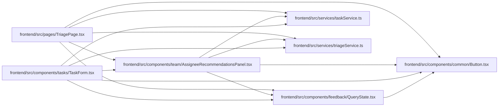

# AssigneeRecommendationsPanel Module

**Path:** `frontend/src/components/team/AssigneeRecommendationsPanel.tsx`

## Description

_Auto-generated from `frontend/src/components/team/AssigneeRecommendationsPanel.tsx`._

## Imports

| Source | Symbols |
|--------|---------|
| `../../services/taskService` | `taskService` |
| `../../services/triageService` | `triageService` |
| `../common/Button` | `Button` |
| `../feedback/QueryState` | `QueryErrorState` |
| `@tanstack/react-query` | `useQuery` |
| `lucide-react` | `AlertTriangle`, `CheckCircle2`, `UserCheck` |
| `react-i18next` | `useTranslation` |

## Module Signals

| Signal | Values |
|--------|--------|
| Exports | `AssigneeRecommendationsPanel` |

## Local dependency map

<!-- Auto-generated local dependency summary. Do not edit by hand. -->

### Internal neighbors

| Direction | Module |
|---|---|
| Inbound | [TaskForm](../modules/TaskForm.md) |
| Inbound | [TriagePage](../modules/TriagePage.md) |
| Outbound | [Button](../modules/Button.md) |
| Outbound | [QueryState](../modules/QueryState.md) |
| Outbound | [taskService](../modules/taskService.md) |
| Outbound | [triageService](../modules/triageService.md) |

### External packages

| Language | Used packages | Undeclared packages |
|---|---:|---:|
| typescript | 3 | 0 |

## Classes

| Class | Kind | Line | Bases / Target | Description |
|-------|------|------|----------------|-------------|
| [AssigneeRecommendationsPanelProps](../entities/AssigneeRecommendationsPanelProps.md) | Class | 9 | — | — |

## Functions

| Function | Signature | Decorators | Description |
|----------|-----------|------------|-------------|
| `AssigneeRecommendationsPanel` | `({     targetType,     taskId,     triageItemId,     iterationId,     selectedAssigneeId,     onSelectAssignee, }: AssigneeRecommendationsPanelProps)` | — | — |
