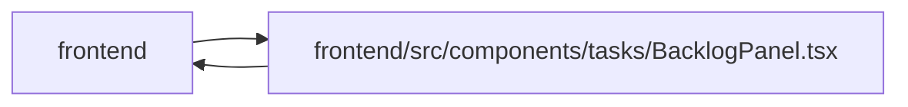

# BacklogPanel Module

**Path:** `frontend/src/components/tasks/BacklogPanel.tsx`

## Description

Provides project-scoped capture and bounded backlog navigation without inventing an iteration. A project must be chosen for creation, and the shared guarded editor retains task drafts.

## Imports

| Source | Symbols | Type-only | Runtime emission |
|--------|---------|-----------|------------------|
| `../../components/common/Select` | `Select` | — | compiler-dependent |
| `../../components/feedback/LiveWindowStatus` | `LiveWindowStatus` | — | compiler-dependent |
| `../../features/scope/useScopeLink` | `useLinkScope`, `useScopeLink` | — | compiler-dependent |
| `../../features/scope/useWorkScope` | `useSetWorkScope` | — | compiler-dependent |
| `../../features/useLiveWindow` | `useLiveWindow` | — | compiler-dependent |
| `../../services/projectService` | `projectService` | — | compiler-dependent |
| `../../services/taskService` | `taskService` | — | compiler-dependent |
| `../../utils/taskState` | `stateOf` | — | compiler-dependent |
| `../common/Button` | `Button` | — | compiler-dependent |
| `../feedback/QueryState` | `QueryErrorState` | — | compiler-dependent |
| `./GuardedTaskDrawer` | `GuardedTaskDrawer` | — | compiler-dependent |
| `@tanstack/react-query` | `useQuery` | — | compiler-dependent |
| `react` | `useId`, `useState` | — | compiler-dependent |
| `react-i18next` | `useTranslation` | — | compiler-dependent |
| `react-router-dom` | `Link`, `useSearchParams` | — | compiler-dependent |

## Module Signals

| Signal | Values |
|--------|--------|
| Exports | `BacklogPanel` |

## Local dependency map

<!-- Auto-generated local dependency summary. Do not edit by hand. -->

```mermaid
flowchart LR
    n0["frontend"]
    n1["frontend/src/components/tasks/BacklogPanel.tsx"]
    n0 --> n1
    n1 --> n0
    click n1 "../modules/BacklogPanel.md"
```

> Module-level dependencies exceed the generated-diagram limits, so the diagram and table below group them by top-level package. Counts report the number of module neighbors in each package.

### Internal neighbors

| Direction | Module |
|---|---|
| Inbound | `frontend` (1) |
| Outbound | `frontend` (11) |

### External packages

| Language | Used packages | Undeclared packages |
|---|---:|---:|
| typescript | 4 | 0 |

> All 12 module neighbor(s) are summarized by package because the module-level view exceeds the 12-node limit.

## Functions

| Function | Signature | Decorators | Description |
|----------|-----------|------------|-------------|
| `BacklogPanel` | `()` | — | — |
