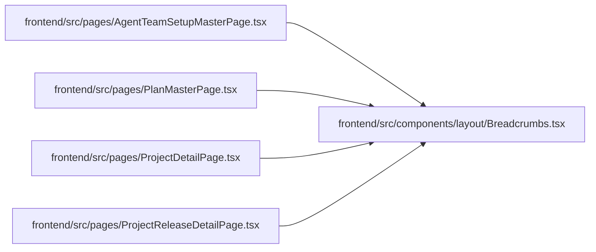

# Breadcrumbs Module

**Path:** `frontend/src/components/layout/Breadcrumbs.tsx`

## Description

_Auto-generated from `frontend/src/components/layout/Breadcrumbs.tsx`._

## Imports

| Source | Symbols |
|--------|---------|
| `lucide-react` | `ChevronRight` |
| `react-i18next` | `useTranslation` |
| `react-router-dom` | `Link` |

## Module Signals

| Signal | Values |
|--------|--------|
| Exports | `Breadcrumbs` |

## Local dependency map

<!-- Auto-generated local dependency summary. Do not edit by hand. -->

### Internal neighbors

| Direction | Module |
|---|---|
| Inbound | [AgentTeamSetupMasterPage](../modules/AgentTeamSetupMasterPage.md) |
| Inbound | [PlanMasterPage](../modules/PlanMasterPage.md) |
| Inbound | [ProjectDetailPage](../modules/ProjectDetailPage.md) |
| Inbound | [ProjectReleaseDetailPage](../modules/ProjectReleaseDetailPage.md) |

### External packages

| Language | Used packages | Undeclared packages |
|---|---:|---:|
| typescript | 3 | 0 |

## Classes

| Class | Kind | Line | Bases / Target | Description |
|-------|------|------|----------------|-------------|
| [BreadcrumbItem](../entities/BreadcrumbItem.md) | Class | 5 | — | — |
| [BreadcrumbsProps](../entities/BreadcrumbsProps.md) | Class | 10 | — | — |

## Functions

| Function | Signature | Decorators | Description |
|----------|-----------|------------|-------------|
| `Breadcrumbs` | `({ items, label }: BreadcrumbsProps)` | — | — |
