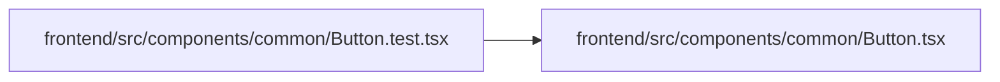

# Button.test Module

**Path:** `frontend/src/components/common/Button.test.tsx`

## Description

_Auto-generated from `frontend/src/components/common/Button.test.tsx`._

## Imports

| Source | Symbols |
|--------|---------|
| `./Button` | `Button` |
| `@testing-library/react` | `render`, `screen` |
| `vitest` | `describe`, `expect`, `it` |

## Module Signals

| Signal | Values |
|--------|--------|
| Module calls | `describe` |

## Local dependency map

<!-- Auto-generated local dependency summary. Do not edit by hand. -->

### Internal neighbors

| Direction | Module |
|---|---|
| Outbound | [Button](../modules/Button.md) |

### External packages

| Language | Used packages | Undeclared packages |
|---|---:|---:|
| typescript | 2 | 0 |
