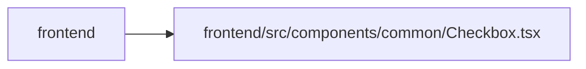

# Checkbox Module

**Path:** `frontend/src/components/common/Checkbox.tsx`

## Description

_Auto-generated from `frontend/src/components/common/Checkbox.tsx`._

## Imports

| Source | Symbols |
|--------|---------|
| `clsx` | `clsx` |
| `lucide-react` | `Check` |
| `react` | `forwardRef` |
| `tailwind-merge` | `twMerge` |

## Module Signals

| Signal | Values |
|--------|--------|
| Exports | `Checkbox`, `CheckboxProps` |
| Constants | `Checkbox` |
| Module calls | `Checkbox = forwardRef` |

## Local dependency map

<!-- Auto-generated local dependency summary. Do not edit by hand. -->

> Module-level dependencies exceed the generated-diagram limits, so the diagram and table below group them by top-level package. Counts report the number of module neighbors in each package.

### Internal neighbors

| Direction | Module |
|---|---|
| Inbound | `frontend` (13) |

### External packages

| Language | Used packages | Undeclared packages |
|---|---:|---:|
| typescript | 4 | 0 |

> All 13 module neighbor(s) are summarized by package because the module-level view exceeds the 12-node limit.

## Classes

| Class | Kind | Line | Bases / Target | Description |
|-------|------|------|----------------|-------------|
| [CheckboxProps](../entities/CheckboxProps.md) | Class | 6 | `Omit` | — |
