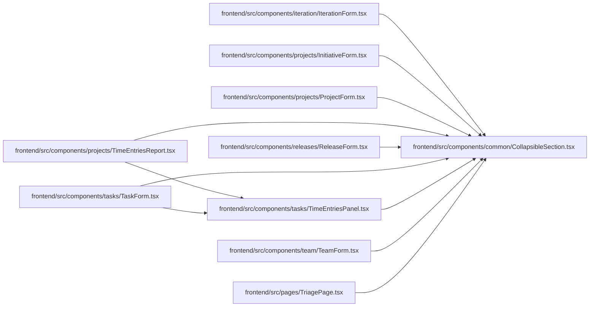

# CollapsibleSection Module

**Path:** `frontend/src/components/common/CollapsibleSection.tsx`

## Description

_Auto-generated from `frontend/src/components/common/CollapsibleSection.tsx`._

## Imports

| Source | Symbols |
|--------|---------|
| `clsx` | `clsx` |
| `lucide-react` | `ChevronDown` |
| `react` | `useId`, `useState` |

## Module Signals

| Signal | Values |
|--------|--------|
| Exports | `CollapsibleSection` |

## Local dependency map

<!-- Auto-generated local dependency summary. Do not edit by hand. -->

### Internal neighbors

| Direction | Module |
|---|---|
| Inbound | [IterationForm](../modules/IterationForm.md) |
| Inbound | [InitiativeForm](../modules/InitiativeForm.md) |
| Inbound | [ProjectForm](../modules/ProjectForm.md) |
| Inbound | [TimeEntriesReport](../modules/TimeEntriesReport.md) |
| Inbound | [ReleaseForm](../modules/ReleaseForm.md) |
| Inbound | [TaskForm](../modules/TaskForm.md) |
| Inbound | [TimeEntriesPanel](../modules/TimeEntriesPanel.md) |
| Inbound | [TeamForm](../modules/TeamForm.md) |
| Inbound | [TriagePage](../modules/TriagePage.md) |

### External packages

| Language | Used packages | Undeclared packages |
|---|---:|---:|
| typescript | 3 | 0 |

## Classes

| Class | Kind | Line | Bases / Target | Description |
|-------|------|------|----------------|-------------|
| [CollapsibleSectionProps](../entities/CollapsibleSectionProps.md) | Class | 5 | — | — |

## Functions

| Function | Signature | Decorators | Description |
|----------|-----------|------------|-------------|
| `CollapsibleSection` | `({ title, defaultOpen = false, children }: CollapsibleSectionProps)` | — | — |
