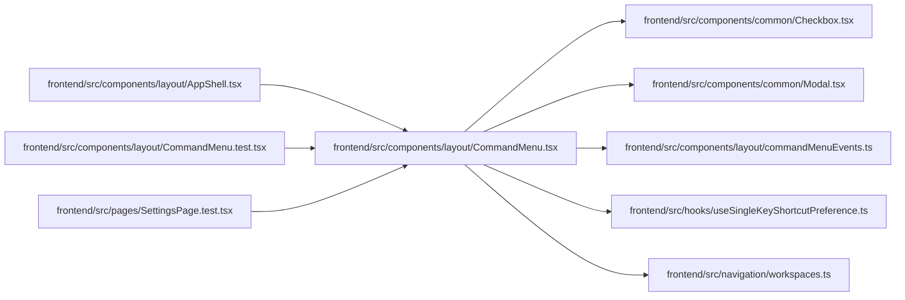

# CommandMenu Module

**Path:** `frontend/src/components/layout/CommandMenu.tsx`

## Description

_Auto-generated from `frontend/src/components/layout/CommandMenu.tsx`._

## Imports

| Source | Symbols |
|--------|---------|
| `../../hooks/useSingleKeyShortcutPreference` | `useSingleKeyShortcutPreference` |
| `../../navigation/workspaces` | `getWorkspaceForPath` |
| `../common/Checkbox` | `Checkbox` |
| `../common/Modal` | `Modal` |
| `./commandMenuEvents` | `OPEN_COMMAND_MENU_EVENT` |
| `lucide-react` | `ArrowUpDown`, `ClipboardCheck`, `Command`, `GanttChartSquare`, `Layers`, `List`, `LayoutGrid`, `ListFilter`, `ListTodo`, `MapPin`, `Maximize2`, `Minimize2`, `Plus`, `Search`, `Settings`, `Users`, `LucideIcon` |
| `react` | `useCallback`, `useEffect`, `useMemo`, `useRef`, `useState`, `KeyboardEvent` |
| `react-i18next` | `useTranslation` |
| `react-router-dom` | `useLocation`, `useNavigate` |

## Module Signals

| Signal | Values |
|--------|--------|
| Exports | `CommandMenu`, `RECENT_COMMANDS_STORAGE_KEY` |
| Constants | `TASKS_FIRST_GROUPS`, `CURRENT_FIRST_GROUPS`, `COMPACT_GROUPS`, `MAX_COMPACT_SUGGESTIONS`, `MAX_RECENT_COMMANDS`, `RECENT_COMMANDS_STORAGE_KEY`, `WORKSPACE_SUGGESTION_IDS` |

## Local dependency map

<!-- Auto-generated local dependency summary. Do not edit by hand. -->

### Internal neighbors

| Direction | Module |
|---|---|
| Inbound | [AppShell](../modules/AppShell.md) |
| Inbound | [CommandMenu.test](../modules/CommandMenu.test.md) |
| Inbound | [SettingsPage.test](../modules/SettingsPage.test.md) |
| Outbound | [Checkbox](../modules/Checkbox.md) |
| Outbound | [Modal](../modules/Modal.md) |
| Outbound | [commandMenuEvents](../modules/commandMenuEvents.md) |
| Outbound | [useSingleKeyShortcutPreference](../modules/useSingleKeyShortcutPreference.md) |
| Outbound | [workspaces](../modules/workspaces.md) |

### External packages

| Language | Used packages | Undeclared packages |
|---|---:|---:|
| typescript | 4 | 0 |

## Classes

| Class | Kind | Line | Bases / Target | Description |
|-------|------|------|----------------|-------------|
| [CommandAction](../entities/CommandAction.md) | Class | 32 | — | — |
| [CommandGroup](../entities/CommandGroup.md) | Type alias | 30 | — | — |

## Functions

| Function | Signature | Decorators | Description |
|----------|-----------|------------|-------------|
| `CommandMenu` | `()` | — | — |
