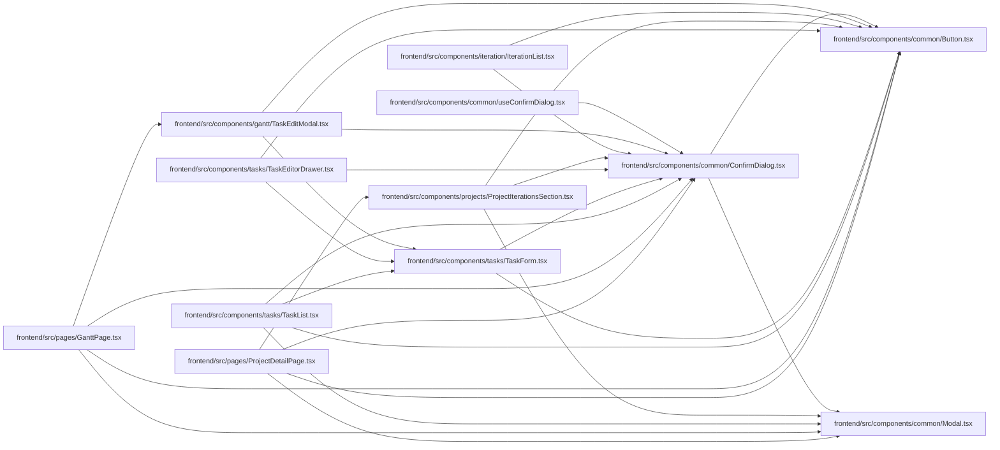

# ConfirmDialog Module

**Path:** `frontend/src/components/common/ConfirmDialog.tsx`

## Description

_Auto-generated from `frontend/src/components/common/ConfirmDialog.tsx`._

## Imports

| Source | Symbols |
|--------|---------|
| `./Button` | `Button` |
| `./Modal` | `Modal` |
| `clsx` | `clsx` |
| `lucide-react` | `AlertTriangle` |
| `react` | `useRef`, `ReactNode` |

## Module Signals

| Signal | Values |
|--------|--------|
| Exports | `ConfirmDialog`, `ConfirmDialogProps`, `ConfirmDialogTone` |
| Constants | `toneTitleClassName` |

## Local dependency map

<!-- Auto-generated local dependency summary. Do not edit by hand. -->

### Internal neighbors

| Direction | Module |
|---|---|
| Inbound | [useConfirmDialog](../modules/useConfirmDialog.md) |
| Inbound | [TaskEditModal](../modules/TaskEditModal.md) |
| Inbound | [IterationList](../modules/IterationList.md) |
| Inbound | [ProjectIterationsSection](../modules/ProjectIterationsSection.md) |
| Inbound | [TaskEditorDrawer](../modules/TaskEditorDrawer.md) |
| Inbound | [TaskForm](../modules/TaskForm.md) |
| Inbound | [TaskList](../modules/TaskList.md) |
| Inbound | [GanttPage](../modules/GanttPage.md) |
| Inbound | [ProjectDetailPage](../modules/ProjectDetailPage.md) |
| Outbound | [Button](../modules/Button.md) |
| Outbound | [Modal](../modules/Modal.md) |

### External packages

| Language | Used packages | Undeclared packages |
|---|---:|---:|
| typescript | 3 | 0 |

## Classes

| Class | Kind | Line | Bases / Target | Description |
|-------|------|------|----------------|-------------|
| [ConfirmDialogProps](../entities/ConfirmDialogProps.md) | Class | 10 | — | — |
| [ConfirmDialogTone](../entities/ConfirmDialogTone.md) | Type alias | 8 | — | — |

## Functions

| Function | Signature | Decorators | Description |
|----------|-----------|------------|-------------|
| `ConfirmDialog` | `({     open,     title,     description,     confirmLabel,     cancelLabel,     closeLabel,     onConfirm,     onCancel,     tone = 'danger',     pending = false, }: ConfirmDialogProps)` | — | A deliberately small destructive-action contract layered on the shared |
