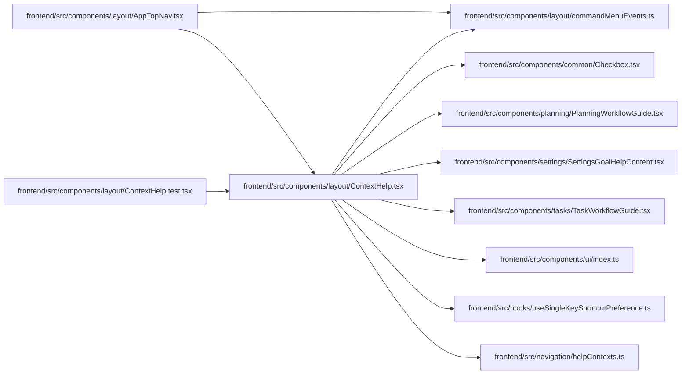

# ContextHelp Module

**Path:** `frontend/src/components/layout/ContextHelp.tsx`

## Description

_Auto-generated from `frontend/src/components/layout/ContextHelp.tsx`._

## Imports

| Source | Symbols |
|--------|---------|
| `../../hooks/useSingleKeyShortcutPreference` | `useSingleKeyShortcutPreference` |
| `../../navigation/helpContexts` | `getHelpContext`, `HelpContentProvider` |
| `../common/Checkbox` | `Checkbox` |
| `../planning/PlanningWorkflowGuide` | `PlanningWorkflowHelpContent` |
| `../settings/SettingsGoalHelpContent` | `SettingsGoalHelpContent` |
| `../tasks/TaskWorkflowGuide` | `TaskWorkflowHelpContent` |
| `../ui` | `SlideOverDrawer` |
| `./commandMenuEvents` | `openCommandMenu` |
| `lucide-react` | `ArrowDownUp`, `ChevronRight`, `CircleHelp`, `Command`, `CornerDownLeft`, `Keyboard` |
| `react` | `useId`, `useState` |
| `react-i18next` | `useTranslation` |
| `react-router-dom` | `Link`, `useLocation` |

## Module Signals

| Signal | Values |
|--------|--------|
| Exports | `ContextHelp` |
| Constants | `PROVIDER_COPY_KEYS`, `TASK_SHORTCUTS` |

## Local dependency map

<!-- Auto-generated local dependency summary. Do not edit by hand. -->

### Internal neighbors

| Direction | Module |
|---|---|
| Inbound | [AppTopNav](../modules/AppTopNav.md) |
| Inbound | [ContextHelp.test](../modules/ContextHelp.test.md) |
| Outbound | [Checkbox](../modules/Checkbox.md) |
| Outbound | [commandMenuEvents](../modules/commandMenuEvents.md) |
| Outbound | [PlanningWorkflowGuide](../modules/PlanningWorkflowGuide.md) |
| Outbound | [SettingsGoalHelpContent](../modules/SettingsGoalHelpContent.md) |
| Outbound | [TaskWorkflowGuide](../modules/TaskWorkflowGuide.md) |
| Outbound | [index](../modules/index.md) |
| Outbound | [useSingleKeyShortcutPreference](../modules/useSingleKeyShortcutPreference.md) |
| Outbound | [helpContexts](../modules/helpContexts.md) |

### External packages

| Language | Used packages | Undeclared packages |
|---|---:|---:|
| typescript | 4 | 0 |

## Functions

| Function | Signature | Decorators | Description |
|----------|-----------|------------|-------------|
| `ContextHelp` | `()` | — | — |
