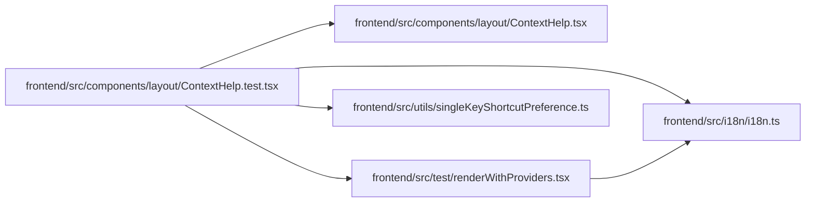

# ContextHelp.test Module

**Path:** `frontend/src/components/layout/ContextHelp.test.tsx`

## Description

_Auto-generated from `frontend/src/components/layout/ContextHelp.test.tsx`._

## Imports

| Source | Symbols | Type-only | Runtime emission |
|--------|---------|-----------|------------------|
| `../../i18n/i18n` | `i18n` | — | compiler-dependent |
| `../../test/renderWithProviders` | `renderWithProviders` | — | compiler-dependent |
| `../../utils/singleKeyShortcutPreference` | `SINGLE_KEY_SHORTCUTS_STORAGE_KEY` | — | compiler-dependent |
| `./ContextHelp` | `ContextHelp` | — | compiler-dependent |
| `@testing-library/react` | `screen`, `within` | — | compiler-dependent |
| `react-router-dom` | `useLocation` | — | compiler-dependent |
| `vitest` | `beforeEach`, `describe`, `expect`, `it` | — | compiler-dependent |

## Module Signals

| Signal | Values |
|--------|--------|
| Module calls | `describe` |

## Local dependency map

<!-- Auto-generated local dependency summary. Do not edit by hand. -->

```mermaid
flowchart LR
    n0["frontend/src/components/layout/ContextHelp.test.tsx"]
    n1["frontend/src/components/layout/ContextHelp.tsx"]
    n2["frontend/src/i18n/i18n.ts"]
    n3["frontend/src/test/renderWithProviders.tsx"]
    n4["frontend/src/utils/singleKeyShortcutPreference.ts"]
    n0 --> n1
    n0 --> n2
    n0 --> n3
    n0 --> n4
    n3 --> n2
    click n0 "../modules/ContextHelp.test.md"
    click n1 "../modules/ContextHelp.md"
    click n2 "../modules/i18n.md"
    click n3 "../modules/renderWithProviders.md"
    click n4 "../modules/singleKeyShortcutPreference.md"
```

### Internal neighbors

| Direction | Module |
|---|---|
| Outbound | [ContextHelp](../modules/ContextHelp.md) |
| Outbound | [i18n](../modules/i18n.md) |
| Outbound | [renderWithProviders](../modules/renderWithProviders.md) |
| Outbound | [singleKeyShortcutPreference](../modules/singleKeyShortcutPreference.md) |

### External packages

| Language | Used packages | Undeclared packages |
|---|---:|---:|
| typescript | 3 | 0 |
