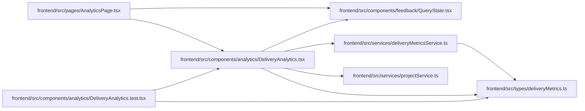

# DeliveryAnalytics Module

**Path:** `frontend/src/components/analytics/DeliveryAnalytics.tsx`

## Description

The human Analytics extension reads delivery reports through ordinary project/iteration authority. A compact duration table exposes means, medians, sample counts, missing starts and incomplete histories. Project selection works without an iteration or agent credential. Failed reads hide cached private queues; loading, retry, empty scopes and missing samples remain explicit.

_Auto-generated from `frontend/src/components/analytics/DeliveryAnalytics.tsx`._

## Imports

| Source | Symbols |
|--------|---------|
| `../../services/deliveryMetricsService` | `deliveryMetricsService` |
| `../../services/projectService` | `projectService` |
| `../../types/deliveryMetrics` | `DeliveryQueueItem` |
| `../feedback/QueryState` | `QueryErrorState` |
| `@tanstack/react-query` | `useQuery` |
| `react` | `useState` |
| `react-i18next` | `useTranslation` |
| `react-router-dom` | `Link` |

## Module Signals

| Signal | Values |
|--------|--------|
| Exports | `DeliveryAnalytics` |

## Local dependency map

<!-- Auto-generated local dependency summary. Do not edit by hand. -->

### Internal neighbors

| Direction | Module |
|---|---|
| Inbound | [DeliveryAnalytics.test](../modules/DeliveryAnalytics.test.md) |
| Inbound | [AnalyticsPage](../modules/AnalyticsPage.md) |
| Outbound | [QueryState](../modules/QueryState.md) |
| Outbound | [deliveryMetricsService](../modules/deliveryMetricsService.md) |
| Outbound | [projectService](../modules/projectService.md) |
| Outbound | [deliveryMetrics](../modules/deliveryMetrics.md) |

### External packages

| Language | Used packages | Undeclared packages |
|---|---:|---:|
| typescript | 4 | 0 |

## Functions

| Function | Signature | Decorators | Description |
|----------|-----------|------------|-------------|
| `DeliveryAnalytics` | `({ iterationId }: { iterationId?: number })` | — | — |
