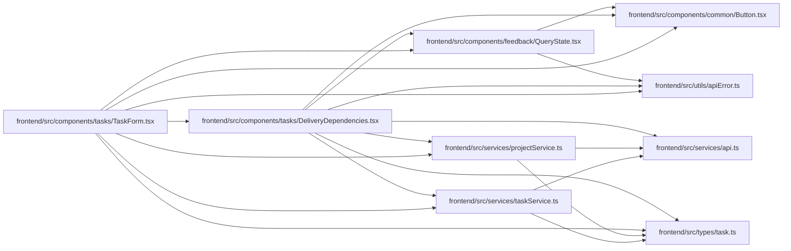

# DeliveryDependencies Module

**Path:** `frontend/src/components/tasks/DeliveryDependencies.tsx`

## Description

Displays delivery readiness and adds or removes typed prerequisites using the dependent task version. Task search and milestone choices are scoped; unavailable targets remain generic. Failed mutations preserve the current selection and expose reconciliation feedback.

## Imports

| Source | Symbols |
|--------|---------|
| `../../services/api` | `api` |
| `../../services/projectService` | `projectService` |
| `../../services/taskService` | `taskService` |
| `../../types/task` | `Task` |
| `../../utils/apiError` | `getApiErrorMessage` |
| `../common/Button` | `Button` |
| `../feedback/QueryState` | `QueryErrorState` |
| `@tanstack/react-query` | `useMutation`, `useQuery` |
| `react` | `useEffect`, `useId`, `useState` |
| `react-i18next` | `useTranslation` |

## Module Signals

| Signal | Values |
|--------|--------|
| Exports | `DeliveryDependencies` |

## Local dependency map

<!-- Auto-generated local dependency summary. Do not edit by hand. -->

### Internal neighbors

| Direction | Module |
|---|---|
| Inbound | [TaskForm](../modules/TaskForm.md) |
| Outbound | [Button](../modules/Button.md) |
| Outbound | [QueryState](../modules/QueryState.md) |
| Outbound | [api](../modules/api.md) |
| Outbound | [projectService](../modules/projectService.md) |
| Outbound | [taskService](../modules/taskService.md) |
| Outbound | [types_task](../modules/types_task.md) |
| Outbound | [apiError](../modules/apiError.md) |

### External packages

| Language | Used packages | Undeclared packages |
|---|---:|---:|
| typescript | 3 | 0 |

## Classes

| Class | Kind | Line | Bases / Target | Description |
|-------|------|------|----------------|-------------|
| [Dependency](../entities/Dependency.md) | Class | 12 | — | — |

## Functions

| Function | Signature | Decorators | Description |
|----------|-----------|------------|-------------|
| `DeliveryDependencies` | `({ task, disabled, onPending, onUpdated }: { task: Task; disabled: boolean; onPending: (pending: boolean) => void; onUpdated: (task: Task) => void })` | — | — |
