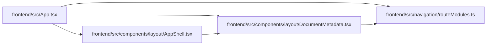

# DocumentMetadata Module

**Path:** `frontend/src/components/layout/DocumentMetadata.tsx`

## Description

_Auto-generated from `frontend/src/components/layout/DocumentMetadata.tsx`._

## Imports

| Source | Symbols |
|--------|---------|
| `../../navigation/routeModules` | `metadataForPath` |
| `react` | `useEffect` |
| `react-i18next` | `useTranslation` |
| `react-router-dom` | `useLocation` |

## Module Signals

| Signal | Values |
|--------|--------|
| Exports | `DocumentMetadata` |

## Local dependency map

<!-- Auto-generated local dependency summary. Do not edit by hand. -->

### Internal neighbors

| Direction | Module |
|---|---|
| Inbound | [App](../modules/App.md) |
| Inbound | [AppShell](../modules/AppShell.md) |
| Outbound | [routeModules](../modules/routeModules.md) |

### External packages

| Language | Used packages | Undeclared packages |
|---|---:|---:|
| typescript | 3 | 0 |

## Functions

| Function | Signature | Decorators | Description |
|----------|-----------|------------|-------------|
| `DocumentMetadata` | `()` | — | — |
