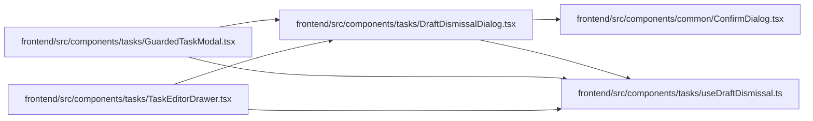

# DraftDismissalDialog Module

**Path:** `frontend/src/components/tasks/DraftDismissalDialog.tsx`

## Description

_Auto-generated from `frontend/src/components/tasks/DraftDismissalDialog.tsx`._

## Imports

| Source | Symbols |
|--------|---------|
| `../common/ConfirmDialog` | `ConfirmDialog` |
| `./useDraftDismissal` | `useDraftDismissal` |
| `react` | `useContext`, `useEffect` |
| `react-i18next` | `useTranslation` |
| `react-router-dom` | `UNSAFE_DataRouterContext`, `useBlocker` |

## Module Signals

| Signal | Values |
|--------|--------|
| Exports | `DraftDismissalDialog` |

## Local dependency map

<!-- Auto-generated local dependency summary. Do not edit by hand. -->

### Internal neighbors

| Direction | Module |
|---|---|
| Inbound | [GuardedTaskModal](../modules/GuardedTaskModal.md) |
| Inbound | [TaskEditorDrawer](../modules/TaskEditorDrawer.md) |
| Outbound | [ConfirmDialog](../modules/ConfirmDialog.md) |
| Outbound | [useDraftDismissal](../modules/useDraftDismissal.md) |

### External packages

| Language | Used packages | Undeclared packages |
|---|---:|---:|
| typescript | 3 | 0 |

## Classes

| Class | Kind | Line | Bases / Target | Description |
|-------|------|------|----------------|-------------|
| [DraftGuard](../entities/DraftGuard.md) | Type alias | 7 | — | — |

## Functions

| Function | Signature | Decorators | Description |
|----------|-----------|------------|-------------|
| `DraftDismissalDialog` | `({ guard }: { guard: DraftGuard })` | — | — |
