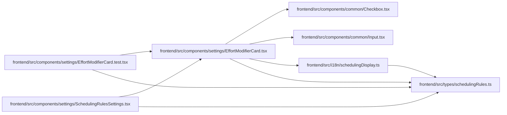

# EffortModifierCard Module

**Path:** `frontend/src/components/settings/EffortModifierCard.tsx`

## Description

_Auto-generated from `frontend/src/components/settings/EffortModifierCard.tsx`._

## Imports

| Source | Symbols |
|--------|---------|
| `../../i18n/schedulingDisplay` | `effortModifierDisplay` |
| `../../types/schedulingRules` | `EffortModifier`, `MATH_OPERATIONS`, `FORMULA_TEMPLATES`, `FORMULA_ASSIGNEE_FIELDS` |
| `../common/Checkbox` | `Checkbox` |
| `../common/Input` | `Input` |
| `lucide-react` | `Trash2`, `ChevronDown`, `ChevronRight`, `Info` |
| `react` | `useState`, `useMemo`, `useId` |
| `react-i18next` | `useTranslation` |

## Module Signals

| Signal | Values |
|--------|--------|
| Exports | `EffortModifierCard` |

## Local dependency map

<!-- Auto-generated local dependency summary. Do not edit by hand. -->

### Internal neighbors

| Direction | Module |
|---|---|
| Inbound | [EffortModifierCard.test](../modules/EffortModifierCard.test.md) |
| Inbound | [SchedulingRulesSettings](../modules/SchedulingRulesSettings.md) |
| Outbound | [Checkbox](../modules/Checkbox.md) |
| Outbound | [Input](../modules/Input.md) |
| Outbound | [schedulingDisplay](../modules/schedulingDisplay.md) |
| Outbound | [schedulingRules](../modules/schedulingRules.md) |

### External packages

| Language | Used packages | Undeclared packages |
|---|---:|---:|
| typescript | 3 | 0 |

## Classes

| Class | Kind | Line | Bases / Target | Description |
|-------|------|------|----------------|-------------|
| [Props](../entities/EffortModifierCard_Props.md) | Class | 10 | — | — |

## Functions

| Function | Signature | Decorators | Description |
|----------|-----------|------------|-------------|
| `EffortModifierCard` | `({ modifier, onChange, onRemove }: Props)` | — | — |
