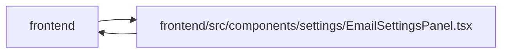

# EmailSettingsPanel Module

**Path:** `frontend/src/components/settings/EmailSettingsPanel.tsx`

## Description

_Auto-generated from `frontend/src/components/settings/EmailSettingsPanel.tsx`._

## Imports

| Source | Symbols |
|--------|---------|
| `../../hooks/useAdminAccess` | `useAdminAccess` |
| `../../services/emailSettingsService` | `emailSettingsService` |
| `../../types/emailSettings` | `EmailSettings` |
| `../../types/systemSettings` | `RuntimeSettingSource` |
| `../../utils/adminAccess` | `getAdminAccessErrorMessage` |
| `../../utils/protectedQueries` | `protectedQueryRetry` |
| `../common/Button` | `Button` |
| `../common/Checkbox` | `Checkbox` |
| `../common/Input` | `Input` |
| `../feedback/QueryState` | `QueryErrorState`, `QueryLoadingState` |
| `../feedback/toast` | `useToast` |
| `@tanstack/react-query` | `useQuery`, `useMutation`, `useQueryClient` |
| `lucide-react` | `Save`, `Mail`, `Server`, `Shield`, `Eye`, `EyeOff`, `Send` |
| `react` | `useRef`, `useState` |
| `react-i18next` | `useTranslation` |

## Module Signals

| Signal | Values |
|--------|--------|
| Exports | `EmailSettingsPanel` |
| Constants | `sourceLabelKey`, `sourceClass` |

## Local dependency map

<!-- Auto-generated local dependency summary. Do not edit by hand. -->

> Module-level dependencies exceed the generated-diagram limits, so the diagram and table below group them by top-level package. Counts report the number of module neighbors in each package.

### Internal neighbors

| Direction | Module |
|---|---|
| Inbound | `frontend` (2) |
| Outbound | `frontend` (11) |

### External packages

| Language | Used packages | Undeclared packages |
|---|---:|---:|
| typescript | 4 | 0 |

> All 13 module neighbor(s) are summarized by package because the module-level view exceeds the 12-node limit.

## Classes

| Class | Kind | Line | Bases / Target | Description |
|-------|------|------|----------------|-------------|
| [EmailValidationErrors](../entities/EmailValidationErrors.md) | Type alias | 47 | — | — |

## Functions

| Function | Signature | Decorators | Description |
|----------|-----------|------------|-------------|
| `EmailSettingsPanel` | `()` | — | — |
