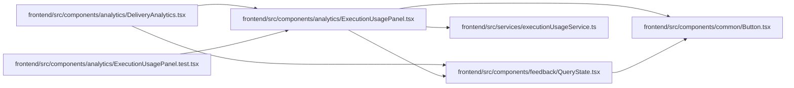

# ExecutionUsagePanel Module

**Path:** `frontend/src/components/analytics/ExecutionUsagePanel.tsx`

## Description

Human Analytics preserves exact decimal strings for costs and separates currency buckets, estimates, unknown human effort and simulations. Advisory comparison requires an explicit currency and keeps local inputs editable after read failures; no agent credential or default spending currency is introduced.

_Auto-generated from `frontend/src/components/analytics/ExecutionUsagePanel.tsx`._

## Imports

| Source | Symbols |
|--------|---------|
| `../../services/executionUsageService` | `executionUsageService` |
| `../common/Button` | `Button` |
| `../feedback/QueryState` | `QueryErrorState` |
| `@tanstack/react-query` | `useQuery` |
| `react` | `useState` |
| `react-i18next` | `useTranslation` |

## Module Signals

| Signal | Values |
|--------|--------|
| Exports | `ExecutionUsagePanel` |

## Local dependency map

<!-- Auto-generated local dependency summary. Do not edit by hand. -->

### Internal neighbors

| Direction | Module |
|---|---|
| Inbound | [DeliveryAnalytics](../modules/DeliveryAnalytics.md) |
| Inbound | [ExecutionUsagePanel.test](../modules/ExecutionUsagePanel.test.md) |
| Outbound | [Button](../modules/Button.md) |
| Outbound | [QueryState](../modules/QueryState.md) |
| Outbound | [executionUsageService](../modules/executionUsageService.md) |

### External packages

| Language | Used packages | Undeclared packages |
|---|---:|---:|
| typescript | 3 | 0 |

## Functions

| Function | Signature | Decorators | Description |
|----------|-----------|------------|-------------|
| `ExecutionUsagePanel` | `({ scope }: { scope: { project_id?: number; iteration_id?: number; lookback_days: number } })` | — | — |
