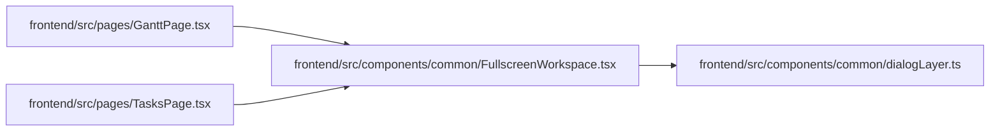

# FullscreenWorkspace Module

**Path:** `frontend/src/components/common/FullscreenWorkspace.tsx`

## Description

_Auto-generated from `frontend/src/components/common/FullscreenWorkspace.tsx`._

## Imports

| Source | Symbols |
|--------|---------|
| `./dialogLayer` | `useDialogLayer` |
| `clsx` | `clsx` |
| `react` | `ReactNode`, `RefObject` |

## Module Signals

| Signal | Values |
|--------|--------|
| Exports | `FullscreenWorkspace` |

## Local dependency map

<!-- Auto-generated local dependency summary. Do not edit by hand. -->

### Internal neighbors

| Direction | Module |
|---|---|
| Inbound | [GanttPage](../modules/GanttPage.md) |
| Inbound | [TasksPage](../modules/TasksPage.md) |
| Outbound | [dialogLayer](../modules/dialogLayer.md) |

### External packages

| Language | Used packages | Undeclared packages |
|---|---:|---:|
| typescript | 2 | 0 |

## Functions

| Function | Signature | Decorators | Description |
|----------|-----------|------------|-------------|
| `FullscreenWorkspace` | `({     open,     onClose,     ariaLabel,     children,     className,     fullscreenClassName,     initialFocusRef, }: {     open: boolean;     onClose: () => void;     ariaLabel: string;     children: ReactNode;     className?: string;     fullscreenClassName?: string;     initialFocusRef?: RefObject<HTMLElement \| null>; })` | — | — |
