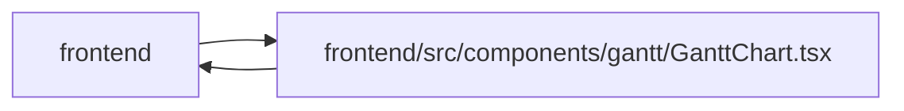

# GanttChart Module

**Path:** `frontend/src/components/gantt/GanttChart.tsx`

## Description

_Auto-generated from `frontend/src/components/gantt/GanttChart.tsx`._

## Imports

| Source | Symbols |
|--------|---------|
| `../../i18n/dateLocale` | `dateFnsLocale` |
| `../../services/ganttService` | `ganttService` |
| `../../types/gantt` | `GanttTask`, `SchedulePreviewResponse` |
| `../../utils/formatDate` | `formatDate` |
| `../common/Button` | `Button` |
| `../common/Checkbox` | `Checkbox` |
| `../feedback/QueryState` | `QueryErrorState`, `QueryLoadingState` |
| `../feedback/toast` | `useToast` |
| `../ui` | `OverflowMenu`, `SlideOverDrawer` |
| `../ui/tone` | `STATUS_TONE`, `toneSolidClassName` |
| `./TaskEditModal` | `TaskEditModal` |
| `@tanstack/react-query` | `useMutation`, `useQueryClient` |
| `@tanstack/react-virtual` | `useVirtualizer` |
| `clsx` | `clsx` |
| `date-fns` | `eachDayOfInterval`, `format`, `isSameDay`, `addDays`, `differenceInCalendarDays`, `parseISO`, `startOfDay` |
| `lucide-react` | `RefreshCw`, `ChevronRight`, `ChevronDown`, `ZoomIn`, `ZoomOut`, `Minimize2`, `Maximize2`, `Calendar`, `CalendarOff`, `ListFilter`, `Eye` |
| `react` | `useState`, `useMemo`, `useRef`, `useEffect`, `useCallback`, `useId` |
| `react-i18next` | `useTranslation` |
| `react-router-dom` | `Link` |

## Module Signals

| Signal | Values |
|--------|--------|
| Exports | `GanttChart` |

## Local dependency map

<!-- Auto-generated local dependency summary. Do not edit by hand. -->

> Module-level dependencies exceed the generated-diagram limits, so the diagram and table below group them by top-level package. Counts report the number of module neighbors in each package.

### Internal neighbors

| Direction | Module |
|---|---|
| Inbound | `frontend` (2) |
| Outbound | `frontend` (11) |

### External packages

| Language | Used packages | Undeclared packages |
|---|---:|---:|
| typescript | 8 | 0 |

> All 13 module neighbor(s) are summarized by package because the module-level view exceeds the 12-node limit.

## Classes

| Class | Kind | Line | Bases / Target | Description |
|-------|------|------|----------------|-------------|
| [GanttChartProps](../entities/GanttChartProps.md) | Class | 22 | — | — |
| [FlattenedTask](../entities/GanttChart_FlattenedTask.md) | Class | 34 | `GanttTask` | — |
| [TaskTimelineDates](../entities/TaskTimelineDates.md) | Class | 38 | — | — |

## Functions

| Function | Signature | Decorators | Description |
|----------|-----------|------------|-------------|
| `GanttChart` | `({     iterationId,     startDate,     endDate,     tasks,     weekends,     holidays,     memberVacations,     sandboxMode = false,     onSaveSandbox, }: GanttChartProps)` | — | — |
