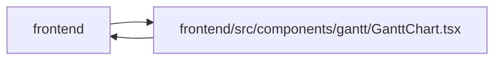

# GanttChart Module

**Path:** `frontend/src/components/gantt/GanttChart.tsx`

## Description

_Auto-generated from `frontend/src/components/gantt/GanttChart.tsx`._

## Imports

| Source | Symbols | Type-only | Runtime emission |
|--------|---------|-----------|------------------|
| `../../features/planningMasters/planningTaskIssues` | `planningIssueTasksHref` | — | compiler-dependent |
| `../../i18n/dateLocale` | `dateFnsLocale` | — | compiler-dependent |
| `../../services/ganttService` | `ganttService` | — | compiler-dependent |
| `../../types/gantt` | `GanttTask`, `SchedulePreviewResponse` | Declaration | erased |
| `../../utils/formatDate` | `formatDate` | — | compiler-dependent |
| `../common/Button` | `Button` | — | compiler-dependent |
| `../common/Checkbox` | `Checkbox` | — | compiler-dependent |
| `../feedback/QueryState` | `QueryErrorState`, `QueryLoadingState` | — | compiler-dependent |
| `../feedback/toast` | `useToast` | — | compiler-dependent |
| `../ui` | `OverflowMenu`, `SlideOverDrawer` | — | compiler-dependent |
| `../ui/tone` | `STATUS_TONE`, `toneSolidClassName` | — | compiler-dependent |
| `./GanttBarInputs` | `GanttBarInputs` | — | compiler-dependent |
| `./TaskEditModal` | `TaskEditModal` | — | compiler-dependent |
| `./UnscheduledTasks` | `UnscheduledTasks` | — | compiler-dependent |
| `@tanstack/react-query` | `useMutation`, `useQueryClient` | — | compiler-dependent |
| `@tanstack/react-virtual` | `useVirtualizer` | — | compiler-dependent |
| `clsx` | `clsx` | — | compiler-dependent |
| `date-fns` | `eachDayOfInterval`, `format`, `isSameDay`, `addDays`, `differenceInCalendarDays`, `parseISO`, `startOfDay` | — | compiler-dependent |
| `lucide-react` | `RefreshCw`, `ChevronRight`, `ChevronDown`, `ZoomIn`, `ZoomOut`, `Minimize2`, `Maximize2`, `Calendar`, `CalendarOff`, `CalendarRange`, `Crosshair`, `GitBranch`, `ListFilter`, `Eye`, `Pin`, `X`, `UserX`, `ChevronsDownUp`, `ChevronsUpDown` | — | compiler-dependent |
| `react` | `CSSProperties`, `KeyboardEvent`, `PointerEvent` | Declaration | erased |
| `react` | `useState`, `useMemo`, `useRef`, `useEffect`, `useCallback`, `useId` | — | compiler-dependent |
| `react-i18next` | `useTranslation` | — | compiler-dependent |
| `react-router-dom` | `Link` | — | compiler-dependent |

## Module Signals

| Signal | Values |
|--------|--------|
| Exports | `GanttChart` |
| Constants | `ZOOM_MIN`, `ZOOM_MAX`, `ZOOM_STEP`, `ZOOM_DEFAULT`, `TASK_COLUMN_MIN`, `TASK_COLUMN_MAX`, `TASK_COLUMN_DEFAULT`, `TASK_COLUMN_STORAGE_KEY`, `LEGEND_STATUSES`, `LINKS_STORAGE_KEY`, `BAR_CENTER_Y`, `GROUP_OPTIONS`, `ID_PREFIX_PATTERN`, `GROUP_STORAGE_KEY`, `AUTO_GROUP_MIN_TASKS` |

## Local dependency map

<!-- Auto-generated local dependency summary. Do not edit by hand. -->
This graph shows full source coupling. Type dependencies can be erased; compiler-dependent cycle groups are runtime candidates, not confirmed initialization cycles.

```mermaid
flowchart LR
    n0["frontend"]
    n1["frontend/src/components/gantt/GanttChart.tsx"]
    n0 --> n1
    n1 --> n0
    click n1 "../modules/GanttChart.md"
```

> Module-level dependencies exceed the generated-diagram limits, so the diagram and table below group them by top-level package. Counts report the number of module neighbors in each package.

### Internal neighbors

| Direction | Module |
|---|---|
| Inbound | `frontend` (2) |
| Outbound | `frontend` (14) |

### External packages

| Language | Used packages | Undeclared packages |
|---|---:|---:|
| typescript | 8 | 0 |

> All 16 module neighbor(s) are summarized by package because the module-level view exceeds the 12-node limit.

## Classes

| Class | Kind | Line | Bases / Target | Description |
|-------|------|------|----------------|-------------|
| [GanttChartProps](../entities/GanttChartProps.md) | Interface | 26 | — | — |
| [FlattenedTask](../entities/GanttChart_FlattenedTask.md) | Interface | 71 | `GanttTask` | — |
| [TaskTimelineDates](../entities/TaskTimelineDates.md) | Interface | 104 | — | — |
| [GanttGroupBy](../entities/GanttGroupBy.md) | Type alias | 76 | `typeof GROUP_OPTIONS[number]` | — |
| [GanttStatusFilter](../entities/GanttStatusFilter.md) | Type alias | 77 | `'' \| 'planned' \| 'active' \| 'resolved' \| 'closed'` | — |
| [GanttRow](../entities/GanttRow.md) | Type alias | 78 | <pre><code>&#124; &#123; kind&#58; &#39;task&#39;&#59; task&#58; FlattenedTask &#125;&#10;    &#124; &#123; kind&#58; &#39;group&#39;&#59; key&#58; string&#59; label&#58; string&#59; count&#58; number&#59; unassigned&#58; number&#59; start&#58; string &#124; null&#59; end&#58; string &#124; null &#125;</code></pre> | — |

## Functions

| Function | Signature | Decorators | Description |
|----------|-----------|------------|-------------|
| `GanttChart` | <pre><code>&#40;&#123;&#10;    iterationId&#44;&#10;    iterationRevision&#44;    startDate&#44;&#10;    endDate&#44;&#10;    tasks&#44;&#10;    weekends&#44;&#10;    holidays&#44;&#10;    memberVacations&#44;&#10;    sandboxMode &#61; false&#44;&#10;    onSaveSandbox&#44;&#10;&#125;&#58; GanttChartProps&#41;</code></pre> | — | — |
