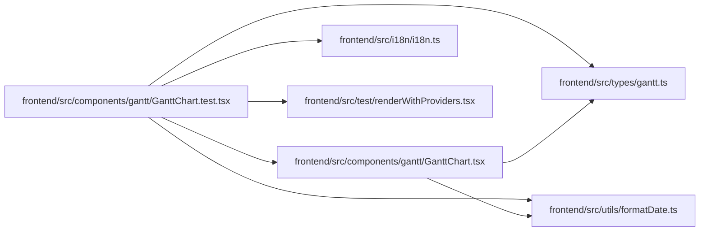

# GanttChart.test Module

**Path:** `frontend/src/components/gantt/GanttChart.test.tsx`

## Description

_Auto-generated from `frontend/src/components/gantt/GanttChart.test.tsx`._

## Imports

| Source | Symbols |
|--------|---------|
| `../../i18n/i18n` | `i18n` |
| `../../test/renderWithProviders` | `renderWithProviders` |
| `../../types/gantt` | `GanttTask`, `SchedulePreviewResponse`, `ScheduleResult` |
| `../../utils/formatDate` | `formatDate` |
| `./GanttChart` | `GanttChart` |
| `@testing-library/react` | `screen`, `waitFor` |
| `vitest` | `beforeEach`, `describe`, `expect`, `it`, `vi` |

## Module Signals

| Signal | Values |
|--------|--------|
| Constants | `ganttServiceMock`, `taskFixture`, `scheduleResult`, `previewFixture` |
| Module calls | `ganttServiceMock = hoisted`, `mock`, `mock`, `mock`, `describe`, `describe` |

## Local dependency map

<!-- Auto-generated local dependency summary. Do not edit by hand. -->

### Internal neighbors

| Direction | Module |
|---|---|
| Outbound | [GanttChart](../modules/GanttChart.md) |
| Outbound | [i18n](../modules/i18n.md) |
| Outbound | [renderWithProviders](../modules/renderWithProviders.md) |
| Outbound | [types_gantt](../modules/types_gantt.md) |
| Outbound | [formatDate](../modules/formatDate.md) |

### External packages

| Language | Used packages | Undeclared packages |
|---|---:|---:|
| typescript | 2 | 0 |
