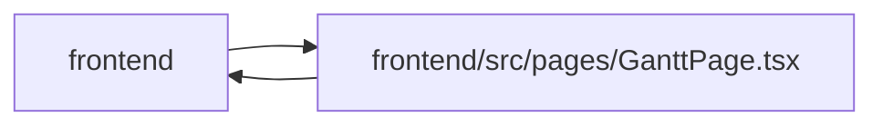

# GanttPage Module

**Path:** `frontend/src/pages/GanttPage.tsx`

## Description

Snapshot restore captures the target iteration identity and its observed revision before confirmation. Managed workspace operators use identity-based admin access; conflicts retain the snapshot for explicit comparison without fetching versions at save.

## Imports

| Source | Symbols |
|--------|---------|
| `../components/common/Button` | `Button` |
| `../components/common/ConfirmDialog` | `ConfirmDialog` |
| `../components/common/FullscreenWorkspace` | `FullscreenWorkspace` |
| `../components/common/Modal` | `Modal` |
| `../components/feedback/toast` | `useToast` |
| `../components/gantt/GanttChart` | `GanttChart` |
| `../components/gantt/ScheduleExplanationDetails` | `ScheduleExplanationDetails` |
| `../components/gantt/TaskEditModal` | `TaskEditModal` |
| `../components/iteration/IterationSelector` | `IterationSelector` |
| `../components/planning/PlanningWorkbenchFrame` | `PlanningWorkbenchFrame` |
| `../components/ui` | `OverflowMenu` |
| `../hooks/useAdminAccess` | `useAdminAccess` |
| `../services/ganttService` | `ganttService` |
| `../services/iterationService` | `iterationService` |
| `../services/planningInputService` | `planningInputService` |
| `../services/snapshotService` | `snapshotService`, `IterationSnapshot` |
| `../services/taskService` | `taskService` |
| `../store/iterationStore` | `useIterationStore` |
| `../types/gantt` | `ExplainScheduleResponse`, `GanttTask` |
| `../types/iteration` | `Iteration` |
| `../types/task` | `TaskBatchUpdateItem`, `TaskUpdate` |
| `../utils/adminAccess` | `getAdminAccessErrorMessage` |
| `../utils/apiError` | `getApiErrorMessage` |
| `../utils/formatDate` | `formatDateTime` |
| `@tanstack/react-query` | `useQuery`, `useMutation`, `useQueryClient` |
| `clsx` | `clsx` |
| `lucide-react` | `AlertTriangle`, `Sparkles`, `Maximize2`, `Minimize2`, `FlaskConical`, `Undo2`, `Check`, `History`, `RefreshCw` |
| `react` | `useState`, `useEffect`, `useMemo`, `useCallback`, `useRef` |
| `react-i18next` | `useTranslation` |
| `react-router-dom` | `Link` |

## Module Signals

| Signal | Values |
|--------|--------|
| Exports | `default` |
| Constants | `DECISION_COUNT_LABELS` |

## Local dependency map

<!-- Auto-generated local dependency summary. Do not edit by hand. -->

> Module-level dependencies exceed the generated-diagram limits, so the diagram and table below group them by top-level package. Counts report the number of module neighbors in each package.

### Internal neighbors

| Direction | Module |
|---|---|
| Inbound | `frontend` (1) |
| Outbound | `frontend` (24) |

### External packages

| Language | Used packages | Undeclared packages |
|---|---:|---:|
| typescript | 6 | 0 |

> All 25 module neighbor(s) are summarized by package because the module-level view exceeds the 12-node limit.
