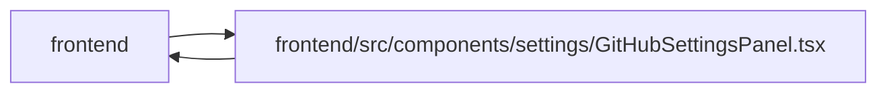

# GitHubSettingsPanel Module

**Path:** `frontend/src/components/settings/GitHubSettingsPanel.tsx`

## Description

_Auto-generated from `frontend/src/components/settings/GitHubSettingsPanel.tsx`._

## Imports

| Source | Symbols |
|--------|---------|
| `../../i18n/seedDisplay` | `githubRuleDisplay` |
| `../../services/githubService` | `githubService` |
| `../../types/github` | `GitHubAutomationEventType`, `GitHubAutomationTargetStatus`, `GitHubStatusAutomationRule`, `GitHubStatusAutomationRuleCreate` |
| `../../types/task` | `TaskStatus` |
| `../../utils/apiError` | `getApiErrorMessage` |
| `../common/Button` | `Button` |
| `../common/Checkbox` | `Checkbox` |
| `../common/Input` | `Input` |
| `../common/useConfirmDialog` | `useConfirmDialog` |
| `../feedback/QueryState` | `QueryErrorState` |
| `../feedback/toast` | `useToast` |
| `@tanstack/react-query` | `useMutation`, `useQuery`, `useQueryClient` |
| `lucide-react` | `Edit2`, `Github`, `Loader2`, `Plus`, `Save`, `Trash2`, `X` |
| `react` | `useId`, `useMemo`, `useState` |
| `react-i18next` | `useTranslation` |

## Module Signals

| Signal | Values |
|--------|--------|
| Exports | `GitHubSettingsPanel` |
| Constants | `eventOptions`, `statusOptions`, `targetStatusOptions` |

## Local dependency map

<!-- Auto-generated local dependency summary. Do not edit by hand. -->

> Module-level dependencies exceed the generated-diagram limits, so the diagram and table below group them by top-level package. Counts report the number of module neighbors in each package.

### Internal neighbors

| Direction | Module |
|---|---|
| Inbound | `frontend` (2) |
| Outbound | `frontend` (11) |

### External packages

| Language | Used packages | Undeclared packages |
|---|---:|---:|
| typescript | 4 | 0 |

> All 13 module neighbor(s) are summarized by package because the module-level view exceeds the 12-node limit.

## Classes

| Class | Kind | Line | Bases / Target | Description |
|-------|------|------|----------------|-------------|
| [FormErrors](../entities/FormErrors.md) | Type alias | 45 | — | — |

## Functions

| Function | Signature | Decorators | Description |
|----------|-----------|------------|-------------|
| `GitHubSettingsPanel` | `()` | — | — |
