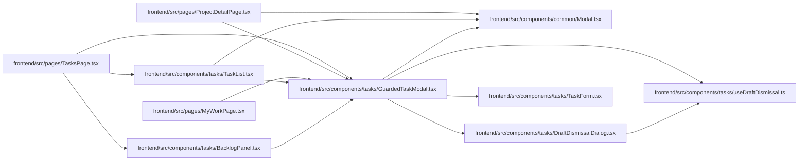

# GuardedTaskModal Module

**Path:** `frontend/src/components/tasks/GuardedTaskModal.tsx`

## Description

_Auto-generated from `frontend/src/components/tasks/GuardedTaskModal.tsx`._

## Imports

| Source | Symbols |
|--------|---------|
| `../common/Modal` | `Modal` |
| `./DraftDismissalDialog` | `DraftDismissalDialog` |
| `./TaskForm` | `TaskForm` |
| `./useDraftDismissal` | `useDraftDismissal` |
| `react` | `ComponentProps`, `ReactNode` |

## Module Signals

| Signal | Values |
|--------|--------|
| Exports | `GuardedTaskModal` |

## Local dependency map

<!-- Auto-generated local dependency summary. Do not edit by hand. -->

### Internal neighbors

| Direction | Module |
|---|---|
| Inbound | [BacklogPanel](../modules/BacklogPanel.md) |
| Inbound | [TaskList](../modules/TaskList.md) |
| Inbound | [MyWorkPage](../modules/MyWorkPage.md) |
| Inbound | [ProjectDetailPage](../modules/ProjectDetailPage.md) |
| Inbound | [TasksPage](../modules/TasksPage.md) |
| Outbound | [Modal](../modules/Modal.md) |
| Outbound | [DraftDismissalDialog](../modules/DraftDismissalDialog.md) |
| Outbound | [TaskForm](../modules/TaskForm.md) |
| Outbound | [useDraftDismissal](../modules/useDraftDismissal.md) |

### External packages

| Language | Used packages | Undeclared packages |
|---|---:|---:|
| typescript | 1 | 0 |

## Classes

| Class | Kind | Line | Bases / Target | Description |
|-------|------|------|----------------|-------------|
| [FormProps](../entities/FormProps.md) | Type alias | 7 | — | — |

## Functions

| Function | Signature | Decorators | Description |
|----------|-----------|------------|-------------|
| `GuardedTaskModal` | `({ title, closeLabel, onClose, ...form }: FormProps & {     title: ReactNode; closeLabel: string; onClose: () => void; })` | — | — |
