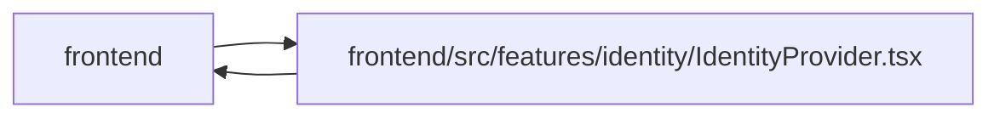

# IdentityProvider Module

**Path:** `frontend/src/features/identity/IdentityProvider.tsx`

## Description

_Auto-generated from `frontend/src/features/identity/IdentityProvider.tsx`._

The web shell exposes managed identity, profile and access state. Work queries are partitioned by principal and grants, cleared across account changes, and periodically refreshed. Expiry retains a same-account draft; a task editor provides a reachable sign-in path even when a modal covers the shell. Explicit logout clears private drafts, credentials and work caches before document navigation. A validated native connection request stays on its consent route to support a different browser account; ordinary or invalid routes return to the homepage.

The workspace factory owns both query freshness and planning invalidation. Account or grant replacement disposes subscriptions and cancels old work requests before clearing that cache; the outer identity client does not install duplicate work policies.

## Imports

| Source | Symbols |
|--------|---------|
| `../../components/common/Button` | `Button` |
| `../../services/api` | `setSessionIntegrity`, `IDENTITY_EXPIRED_EVENT`, `api` |
| `../../services/teamService` | `teamService` |
| `../../utils/adminAccess` | `clearAdminApiKey`, `ADMIN_API_KEY_CHANGED_EVENT` |
| `../../utils/agentAccess` | `clearAgentApiKey`, `AGENT_API_KEY_CHANGED_EVENT` |
| `../../utils/apiError` | `getApiErrorMessage` |
| `../workspaceQueryPolicy` | `createWorkspaceQueryClient`, `installWorkspaceQueryPolicy` |
| `./identityContext` | `IdentityContext`, `useIdentity` |
| `./identityService` | `identityService`, `WorkspaceIdentity` |
| `@tanstack/react-query` | `QueryClientProvider`, `useQuery`, `useQueryClient` |
| `lucide-react` | `LogIn`, `LogOut`, `ShieldCheck`, `User` |
| `react` | `useCallback`, `useEffect`, `useMemo`, `useRef`, `useState`, `ReactNode` |
| `react-i18next` | `useTranslation` |
| `react-router-dom` | `useLocation` |

## Module Signals

| Signal | Values |
|--------|--------|
| Exports | `IdentityBadge`, `IdentityProvider` |

## Local dependency map

<!-- Auto-generated local dependency summary. Do not edit by hand. -->

> Module-level dependencies exceed the generated-diagram limits, so the diagram and table below group them by top-level package. Counts report the number of module neighbors in each package.

### Internal neighbors

| Direction | Module |
|---|---|
| Inbound | `frontend` (3) |
| Outbound | `frontend` (9) |

### External packages

| Language | Used packages | Undeclared packages |
|---|---:|---:|
| typescript | 5 | 0 |

> All 12 module neighbor(s) are summarized by package because the module-level view exceeds the 12-node limit.

## Functions

| Function | Signature | Decorators | Description |
|----------|-----------|------------|-------------|
| `IdentityProvider` | `({ children, navigateAfterSignOut = target => window.location.assign(target) }: { children: ReactNode; navigateAfterSignOut?: (target: string) => void })` | — | — |
| `IdentityBadge` | `()` | — | — |
