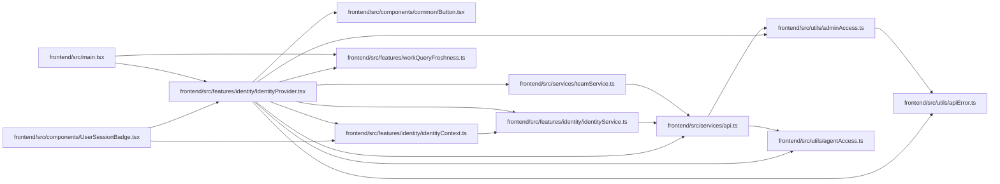

# IdentityProvider Module

**Path:** `frontend/src/features/identity/IdentityProvider.tsx`

## Description

_Auto-generated from `frontend/src/features/identity/IdentityProvider.tsx`._

The web shell exposes managed identity, profile and access state. Work queries are partitioned by principal and grants, cleared across account changes, and periodically refreshed. Expiry retains a same-account draft; a task editor provides a reachable sign-in path even when a modal covers the shell.

## Imports

| Source | Symbols |
|--------|---------|
| `../../components/common/Button` | `Button` |
| `../../services/api` | `setSessionIntegrity`, `IDENTITY_EXPIRED_EVENT`, `api` |
| `../../services/teamService` | `teamService` |
| `../../utils/adminAccess` | `clearAdminApiKey`, `ADMIN_API_KEY_CHANGED_EVENT` |
| `../../utils/agentAccess` | `clearAgentApiKey`, `AGENT_API_KEY_CHANGED_EVENT` |
| `../../utils/apiError` | `getApiErrorMessage` |
| `../workQueryFreshness` | `installWorkFreshness` |
| `./identityContext` | `IdentityContext`, `useIdentity` |
| `./identityService` | `identityService`, `WorkspaceIdentity` |
| `@tanstack/react-query` | `QueryClient`, `QueryClientProvider`, `useQuery`, `useQueryClient` |
| `lucide-react` | `LogIn`, `LogOut`, `ShieldCheck`, `User` |
| `react` | `useCallback`, `useEffect`, `useMemo`, `useRef`, `useState`, `ReactNode` |
| `react-i18next` | `useTranslation` |
| `react-router-dom` | `useLocation` |

## Module Signals

| Signal | Values |
|--------|--------|
| Exports | `IdentityBadge`, `IdentityProvider` |

## Local dependency map

<!-- Auto-generated local dependency summary. Do not edit by hand. -->

### Internal neighbors

| Direction | Module |
|---|---|
| Inbound | [UserSessionBadge](../modules/UserSessionBadge.md) |
| Inbound | [src_main](../modules/src_main.md) |
| Outbound | [Button](../modules/Button.md) |
| Outbound | [identityContext](../modules/identityContext.md) |
| Outbound | [identityService](../modules/identityService.md) |
| Outbound | [workQueryFreshness](../modules/workQueryFreshness.md) |
| Outbound | [api](../modules/api.md) |
| Outbound | [teamService](../modules/teamService.md) |
| Outbound | [adminAccess](../modules/adminAccess.md) |
| Outbound | [agentAccess](../modules/agentAccess.md) |
| Outbound | [apiError](../modules/apiError.md) |

### External packages

| Language | Used packages | Undeclared packages |
|---|---:|---:|
| typescript | 5 | 0 |

## Functions

| Function | Signature | Decorators | Description |
|----------|-----------|------------|-------------|
| `IdentityProvider` | `({ children }: { children: ReactNode })` | — | — |
| `IdentityBadge` | `()` | — | — |