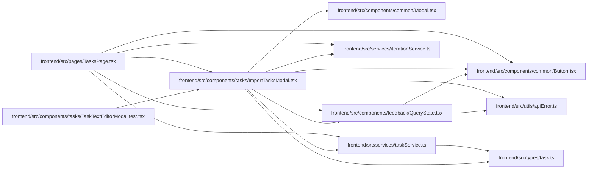

# ImportTasksModal Module

**Path:** `frontend/src/components/tasks/ImportTasksModal.tsx`

## Description

Text imports capture an observed planning revision before input is enabled. Conflicts retain input and require explicit context reload. File readers are owned by a generation, canceled on replacement/unmount, and prevent submission while pending; stale callbacks cannot replace a later file.

_Auto-generated from `frontend/src/components/tasks/ImportTasksModal.tsx`._

## Imports

| Source | Symbols |
|--------|---------|
| `../../services/iterationService` | `iterationService` |
| `../../services/taskService` | `taskService` |
| `../../types/task` | `TaskImportDestination` |
| `../../utils/apiError` | `getApiErrorMessage`, `normalizeApiError` |
| `../common/Button` | `Button` |
| `../common/Modal` | `Modal` |
| `../feedback/QueryState` | `QueryErrorState` |
| `@tanstack/react-query` | `useMutation`, `useQuery`, `useQueryClient` |
| `clsx` | `clsx` |
| `lucide-react` | `Upload`, `FileText`, `AlertCircle`, `CheckCircle`, `Maximize2`, `Minimize2`, `Inbox` |
| `react` | `useEffect`, `useState`, `useRef` |
| `react-i18next` | `useTranslation` |

## Module Signals

| Signal | Values |
|--------|--------|
| Exports | `ImportTasksModal` |

## Local dependency map

<!-- Auto-generated local dependency summary. Do not edit by hand. -->

### Internal neighbors

| Direction | Module |
|---|---|
| Inbound | [TaskTextEditorModal.test](../modules/TaskTextEditorModal.test.md) |
| Inbound | [TasksPage](../modules/TasksPage.md) |
| Outbound | [Button](../modules/Button.md) |
| Outbound | [Modal](../modules/Modal.md) |
| Outbound | [QueryState](../modules/QueryState.md) |
| Outbound | [iterationService](../modules/iterationService.md) |
| Outbound | [taskService](../modules/taskService.md) |
| Outbound | [types_task](../modules/types_task.md) |
| Outbound | [apiError](../modules/apiError.md) |

### External packages

| Language | Used packages | Undeclared packages |
|---|---:|---:|
| typescript | 5 | 0 |

## Classes

| Class | Kind | Line | Bases / Target | Description |
|-------|------|------|----------------|-------------|
| [ImportTasksModalProps](../entities/ImportTasksModalProps.md) | Class | 14 | — | — |
| [ImportTasksBodyProps](../entities/ImportTasksBodyProps.md) | Class | 28 | `ImportTasksModalProps` | — |

## Functions

| Function | Signature | Decorators | Description |
|----------|-----------|------------|-------------|
| `ImportTasksModal` | `({ iterationId, onClose }: ImportTasksModalProps)` | — | — |
