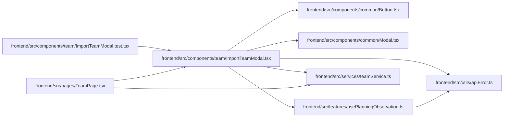

# ImportTeamModal Module

**Path:** `frontend/src/components/team/ImportTeamModal.tsx`

## Description

_Auto-generated from `frontend/src/components/team/ImportTeamModal.tsx`._

## Imports

| Source | Symbols |
|--------|---------|
| `../../features/usePlanningObservation` | `usePlanningObservation` |
| `../../services/teamService` | `teamService` |
| `../../utils/apiError` | `getApiErrorMessage` |
| `../common/Button` | `Button` |
| `../common/Modal` | `Modal` |
| `@tanstack/react-query` | `useMutation`, `useQueryClient` |
| `lucide-react` | `Upload`, `FileText`, `AlertCircle` |
| `react` | `useEffect`, `useId`, `useRef`, `useState` |
| `react-i18next` | `useTranslation` |

## Module Signals

| Signal | Values |
|--------|--------|
| Exports | `ImportTeamModal` |
| Constants | `MAX_IMPORT_ROWS` |

## Local dependency map

<!-- Auto-generated local dependency summary. Do not edit by hand. -->

### Internal neighbors

| Direction | Module |
|---|---|
| Inbound | [ImportTeamModal.test](../modules/ImportTeamModal.test.md) |
| Inbound | [TeamPage](../modules/TeamPage.md) |
| Outbound | [Button](../modules/Button.md) |
| Outbound | [Modal](../modules/Modal.md) |
| Outbound | [usePlanningObservation](../modules/usePlanningObservation.md) |
| Outbound | [teamService](../modules/teamService.md) |
| Outbound | [apiError](../modules/apiError.md) |

### External packages

| Language | Used packages | Undeclared packages |
|---|---:|---:|
| typescript | 4 | 0 |

## Classes

| Class | Kind | Line | Bases / Target | Description |
|-------|------|------|----------------|-------------|
| [ImportTeamModalProps](../entities/ImportTeamModalProps.md) | Class | 13 | — | — |

## Functions

| Function | Signature | Decorators | Description |
|----------|-----------|------------|-------------|
| `ImportTeamModal` | `({     iterationId,     onClose,     onSuccess: onImportSuccess,     onStateChange, }: ImportTeamModalProps)` | — | — |
