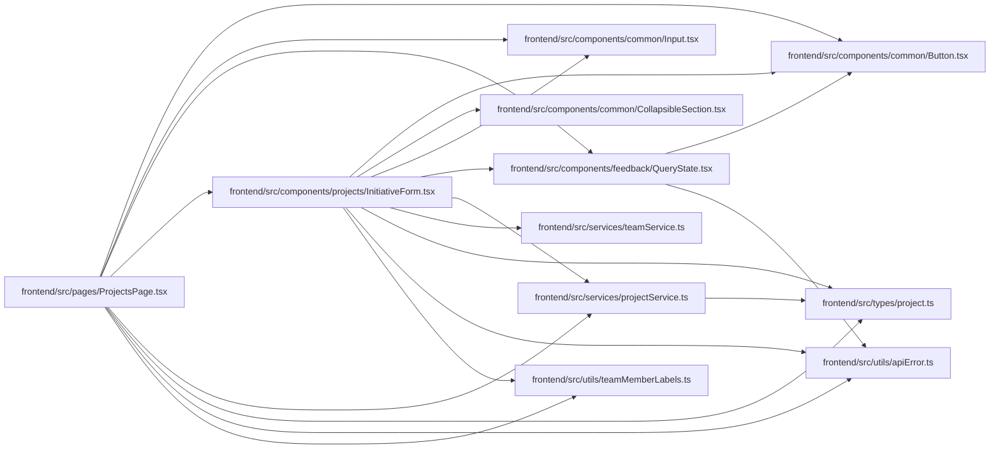

# InitiativeForm Module

**Path:** `frontend/src/components/projects/InitiativeForm.tsx`

## Description

_Auto-generated from `frontend/src/components/projects/InitiativeForm.tsx`._

## Imports

| Source | Symbols |
|--------|---------|
| `../../services/projectService` | `projectService` |
| `../../services/teamService` | `teamService` |
| `../../types/project` | `Initiative`, `InitiativeCreate`, `ProjectHealth` |
| `../../utils/apiError` | `getApiErrorMessage` |
| `../../utils/teamMemberLabels` | `formatTeamMemberProfileLabel` |
| `../common/Button` | `Button` |
| `../common/CollapsibleSection` | `CollapsibleSection` |
| `../common/Input` | `Input` |
| `../feedback/QueryState` | `QueryErrorState`, `QueryLoadingState` |
| `@tanstack/react-query` | `useMutation`, `useQuery`, `useQueryClient` |
| `lucide-react` | `Save` |
| `react` | `useState` |
| `react-i18next` | `useTranslation` |

## Module Signals

| Signal | Values |
|--------|--------|
| Exports | `InitiativeForm` |
| Constants | `healthOptions` |

## Local dependency map

<!-- Auto-generated local dependency summary. Do not edit by hand. -->

### Internal neighbors

| Direction | Module |
|---|---|
| Inbound | [ProjectsPage](../modules/ProjectsPage.md) |
| Outbound | [Button](../modules/Button.md) |
| Outbound | [CollapsibleSection](../modules/CollapsibleSection.md) |
| Outbound | [Input](../modules/Input.md) |
| Outbound | [QueryState](../modules/QueryState.md) |
| Outbound | [projectService](../modules/projectService.md) |
| Outbound | [teamService](../modules/teamService.md) |
| Outbound | [types_project](../modules/types_project.md) |
| Outbound | [apiError](../modules/apiError.md) |
| Outbound | [teamMemberLabels](../modules/teamMemberLabels.md) |

### External packages

| Language | Used packages | Undeclared packages |
|---|---:|---:|
| typescript | 4 | 0 |

## Classes

| Class | Kind | Line | Bases / Target | Description |
|-------|------|------|----------------|-------------|
| [InitiativeFormProps](../entities/InitiativeFormProps.md) | Class | 15 | — | — |
| [InitiativeFormState](../entities/InitiativeFormState.md) | Type alias | 21 | — | — |

## Functions

| Function | Signature | Decorators | Description |
|----------|-----------|------------|-------------|
| `InitiativeForm` | `({ initialData, onSuccess, onCancel }: InitiativeFormProps)` | — | — |
