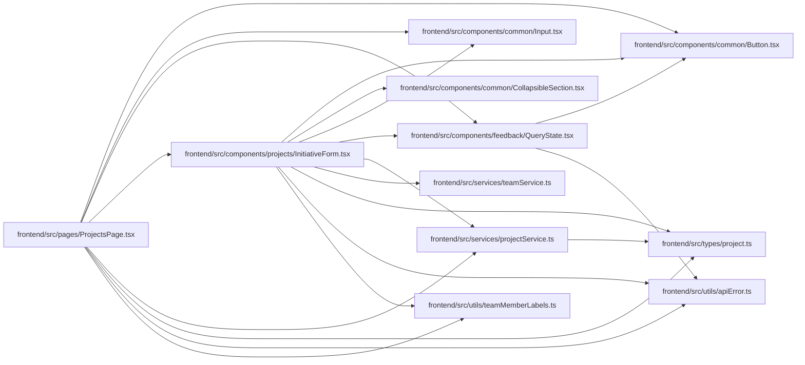

# InitiativeForm Module

**Path:** `frontend/src/components/projects/InitiativeForm.tsx`

## Description

_Auto-generated from `frontend/src/components/projects/InitiativeForm.tsx`._

## Imports

| Source | Symbols | Type-only | Runtime emission |
|--------|---------|-----------|------------------|
| `../../services/projectService` | `projectService` | — | compiler-dependent |
| `../../services/teamService` | `teamService` | — | compiler-dependent |
| `../../types/project` | `Initiative`, `InitiativeCreate`, `ProjectHealth` | Declaration | erased |
| `../../utils/apiError` | `getApiErrorMessage` | — | compiler-dependent |
| `../../utils/teamMemberLabels` | `formatTeamMemberProfileLabel` | — | compiler-dependent |
| `../common/Button` | `Button` | — | compiler-dependent |
| `../common/CollapsibleSection` | `CollapsibleSection` | — | compiler-dependent |
| `../common/Input` | `Input` | — | compiler-dependent |
| `../feedback/QueryState` | `QueryErrorState`, `QueryLoadingState` | — | compiler-dependent |
| `@tanstack/react-query` | `useMutation`, `useQuery`, `useQueryClient` | — | compiler-dependent |
| `lucide-react` | `Save` | — | compiler-dependent |
| `react` | `useState` | — | compiler-dependent |
| `react-i18next` | `useTranslation` | — | compiler-dependent |

## Module Signals

| Signal | Values |
|--------|--------|
| Exports | `InitiativeForm` |
| Constants | `healthOptions` |

## Local dependency map

<!-- Auto-generated local dependency summary. Do not edit by hand. -->
This graph shows full source coupling. Type dependencies can be erased; compiler-dependent cycle groups are runtime candidates, not confirmed initialization cycles.

```mermaid
flowchart LR
    n0["frontend/src/components/common/Button.tsx"]
    n1["frontend/src/components/common/CollapsibleSection.tsx"]
    n2["frontend/src/components/common/Input.tsx"]
    n3["frontend/src/components/feedback/QueryState.tsx"]
    n4["frontend/src/components/projects/InitiativeForm.tsx"]
    n5["frontend/src/pages/ProjectsPage.tsx"]
    n6["frontend/src/services/projectService.ts"]
    n7["frontend/src/services/teamService.ts"]
    n8["frontend/src/types/project.ts"]
    n9["frontend/src/utils/apiError.ts"]
    n10["frontend/src/utils/teamMemberLabels.ts"]
    n3 --> n0
    n3 --> n9
    n4 --> n0
    n4 --> n1
    n4 --> n2
    n4 --> n3
    n4 --> n6
    n4 --> n7
    n4 --> n8
    n4 --> n9
    n4 --> n10
    n5 --> n0
    n5 --> n2
    n5 --> n3
    n5 --> n4
    n5 --> n6
    n5 --> n8
    n5 --> n9
    n5 --> n10
    n6 --> n8
    click n0 "../modules/Button.md"
    click n1 "../modules/CollapsibleSection.md"
    click n2 "../modules/Input.md"
    click n3 "../modules/QueryState.md"
    click n4 "../modules/InitiativeForm.md"
    click n5 "../modules/ProjectsPage.md"
    click n6 "../modules/projectService.md"
    click n7 "../modules/teamService.md"
    click n8 "../modules/types_project.md"
    click n9 "../modules/apiError.md"
    click n10 "../modules/teamMemberLabels.md"
```

### Internal neighbors

| Direction | Module |
|---|---|
| Inbound | [ProjectsPage](../modules/ProjectsPage.md) |
| Outbound | [Button](../modules/Button.md) |
| Outbound | [CollapsibleSection](../modules/CollapsibleSection.md) |
| Outbound | [Input](../modules/Input.md) |
| Outbound | [QueryState](../modules/QueryState.md) |
| Outbound | [projectService](../modules/projectService.md) |
| Outbound | [teamService](../modules/teamService.md) |
| Outbound | [types_project](../modules/types_project.md) |
| Outbound | [apiError](../modules/apiError.md) |
| Outbound | [teamMemberLabels](../modules/teamMemberLabels.md) |

### External packages

| Language | Used packages | Undeclared packages |
|---|---:|---:|
| typescript | 4 | 0 |

## Classes

| Class | Kind | Line | Bases / Target | Description |
|-------|------|------|----------------|-------------|
| [InitiativeFormProps](../entities/InitiativeFormProps.md) | Interface | 15 | — | — |
| [InitiativeFormState](../entities/InitiativeFormState.md) | Type alias | 21 | `InitiativeCreate` | — |

## Functions

| Function | Signature | Decorators | Description |
|----------|-----------|------------|-------------|
| `InitiativeForm` | `({ initialData, onSuccess, onCancel }: InitiativeFormProps)` | — | — |
