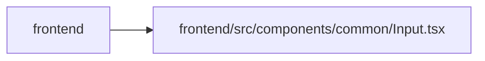

# Input Module

**Path:** `frontend/src/components/common/Input.tsx`

## Description

_Auto-generated from `frontend/src/components/common/Input.tsx`._

## Imports

| Source | Symbols | Type-only | Runtime emission |
|--------|---------|-----------|------------------|
| `clsx` | `clsx` | — | compiler-dependent |
| `react` | `InputHTMLAttributes` | Declaration | erased |
| `react` | `forwardRef`, `useId` | — | compiler-dependent |
| `react-i18next` | `useTranslation` | — | compiler-dependent |

## Module Signals

| Signal | Values |
|--------|--------|
| Exports | `Input`, `RequiredIndicator` |
| Constants | `Input` |
| Module calls | `Input = forwardRef` |

## Local dependency map

<!-- Auto-generated local dependency summary. Do not edit by hand. -->

```mermaid
flowchart LR
    n0["frontend"]
    n1["frontend/src/components/common/Input.tsx"]
    n0 --> n1
    click n1 "../modules/Input.md"
```

> Module-level dependencies exceed the generated-diagram limits, so the diagram and table below group them by top-level package. Counts report the number of module neighbors in each package.

### Internal neighbors

| Direction | Module |
|---|---|
| Inbound | `frontend` (31) |

### External packages

| Language | Used packages | Undeclared packages |
|---|---:|---:|
| typescript | 3 | 0 |

> All 31 module neighbor(s) are summarized by package because the module-level view exceeds the 12-node limit.

## Classes

| Class | Kind | Line | Bases / Target | Description |
|-------|------|------|----------------|-------------|
| [InputProps](../entities/InputProps.md) | Interface | 6 | `InputHTMLAttributes<HTMLInputElement>` | — |

## Functions

| Function | Signature | Decorators | Description |
|----------|-----------|------------|-------------|
| `RequiredIndicator` | `()` | — | — |
