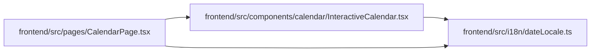

# InteractiveCalendar Module

**Path:** `frontend/src/components/calendar/InteractiveCalendar.tsx`

## Description

_Auto-generated from `frontend/src/components/calendar/InteractiveCalendar.tsx`._

## Imports

| Source | Symbols |
|--------|---------|
| `../../i18n/dateLocale` | `dateFnsLocale` |
| `clsx` | `clsx` |
| `date-fns` | `format`, `startOfMonth`, `endOfMonth`, `eachDayOfInterval`, `getDay` |
| `lucide-react` | `ChevronLeft`, `ChevronRight` |
| `react-i18next` | `useTranslation` |

## Module Signals

| Signal | Values |
|--------|--------|
| Exports | `CalendarPeriodNavigator`, `InteractiveCalendar` |

## Local dependency map

<!-- Auto-generated local dependency summary. Do not edit by hand. -->

### Internal neighbors

| Direction | Module |
|---|---|
| Inbound | [CalendarPage](../modules/CalendarPage.md) |
| Outbound | [dateLocale](../modules/dateLocale.md) |

### External packages

| Language | Used packages | Undeclared packages |
|---|---:|---:|
| typescript | 4 | 0 |

## Classes

| Class | Kind | Line | Bases / Target | Description |
|-------|------|------|----------------|-------------|
| [CalendarPeriodNavigatorProps](../entities/CalendarPeriodNavigatorProps.md) | Class | 10 | — | — |
| [InteractiveCalendarProps](../entities/InteractiveCalendarProps.md) | Class | 20 | — | — |

## Functions

| Function | Signature | Decorators | Description |
|----------|-----------|------------|-------------|
| `CalendarPeriodNavigator` | `({     year,     month,     holidays,     weekendDays,     onYearChange,     onMonthChange,     className, }: CalendarPeriodNavigatorProps)` | — | — |
| `InteractiveCalendar` | `({     year,     month,     holidays,     shortDays,     weekendDays,     onYearChange,     onMonthChange,     onAddHoliday,     onRemoveHoliday,     onAddShortDay,     onRemoveShortDay }: InteractiveCalendarProps)` | — | — |
