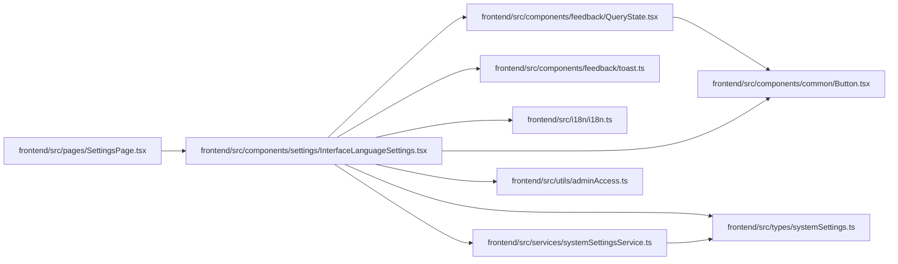

# InterfaceLanguageSettings Module

**Path:** `frontend/src/components/settings/InterfaceLanguageSettings.tsx`

## Description

_Auto-generated from `frontend/src/components/settings/InterfaceLanguageSettings.tsx`._

## Imports

| Source | Symbols |
|--------|---------|
| `../../i18n/i18n` | `changeAppLanguage` |
| `../../services/systemSettingsService` | `systemSettingsService` |
| `../../types/systemSettings` | `AppRuntimeSettingsUpdate`, `LanguageCode`, `RuntimeSettingSource`, `SystemSettings` |
| `../../utils/adminAccess` | `getAdminAccessErrorMessage` |
| `../common/Button` | `Button` |
| `../feedback/QueryState` | `QueryErrorState`, `QueryLoadingState` |
| `../feedback/toast` | `useToast` |
| `@tanstack/react-query` | `useMutation`, `useQuery`, `useQueryClient` |
| `lucide-react` | `Globe2`, `Save` |
| `react` | `useState` |
| `react-i18next` | `useTranslation` |

## Module Signals

| Signal | Values |
|--------|--------|
| Exports | `InterfaceLanguageSettings` |
| Constants | `sourceClass` |

## Local dependency map

<!-- Auto-generated local dependency summary. Do not edit by hand. -->

### Internal neighbors

| Direction | Module |
|---|---|
| Inbound | [SettingsPage](../modules/SettingsPage.md) |
| Outbound | [Button](../modules/Button.md) |
| Outbound | [QueryState](../modules/QueryState.md) |
| Outbound | [toast](../modules/toast.md) |
| Outbound | [i18n](../modules/i18n.md) |
| Outbound | [systemSettingsService](../modules/systemSettingsService.md) |
| Outbound | [systemSettings](../modules/systemSettings.md) |
| Outbound | [adminAccess](../modules/adminAccess.md) |

### External packages

| Language | Used packages | Undeclared packages |
|---|---:|---:|
| typescript | 4 | 0 |

## Functions

| Function | Signature | Decorators | Description |
|----------|-----------|------------|-------------|
| `InterfaceLanguageSettings` | `()` | — | — |
