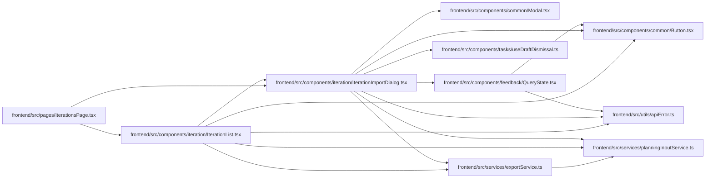

# IterationImportDialog Module

**Path:** `frontend/src/components/iteration/IterationImportDialog.tsx`

## Description

JSON import confirms the retained file against its original complete observation. Conflicts retain the file and require an explicit current-input review to change context; no save-time read or automatic retry occurs.

## Imports

| Source | Symbols |
|--------|---------|
| `../../services/exportService` | `exportService` |
| `../../services/planningInputService` | `ObservedRevisions` |
| `../../utils/apiError` | `getApiErrorMessage` |
| `../common/Button` | `Button` |
| `../common/Modal` | `Modal` |
| `../feedback/QueryState` | `QueryErrorState`, `QueryLoadingState` |
| `../tasks/useDraftDismissal` | `useActiveMount` |
| `@tanstack/react-query` | `useMutation`, `useQuery`, `useQueryClient` |
| `react` | `useId` |
| `react-i18next` | `useTranslation` |

## Module Signals

| Signal | Values |
|--------|--------|
| Exports | `IterationImportDialog` |

## Local dependency map

<!-- Auto-generated local dependency summary. Do not edit by hand. -->

### Internal neighbors

| Direction | Module |
|---|---|
| Inbound | [IterationList](../modules/IterationList.md) |
| Inbound | [IterationsPage](../modules/IterationsPage.md) |
| Outbound | [Button](../modules/Button.md) |
| Outbound | [Modal](../modules/Modal.md) |
| Outbound | [QueryState](../modules/QueryState.md) |
| Outbound | [useDraftDismissal](../modules/useDraftDismissal.md) |
| Outbound | [exportService](../modules/exportService.md) |
| Outbound | [planningInputService](../modules/planningInputService.md) |
| Outbound | [apiError](../modules/apiError.md) |

### External packages

| Language | Used packages | Undeclared packages |
|---|---:|---:|
| typescript | 3 | 0 |

## Functions

| Function | Signature | Decorators | Description |
|----------|-----------|------------|-------------|
| `IterationImportDialog` | `({ file, iterationId, onClose }: { file: File; iterationId?: number; onClose: () => void })` | — | — |
