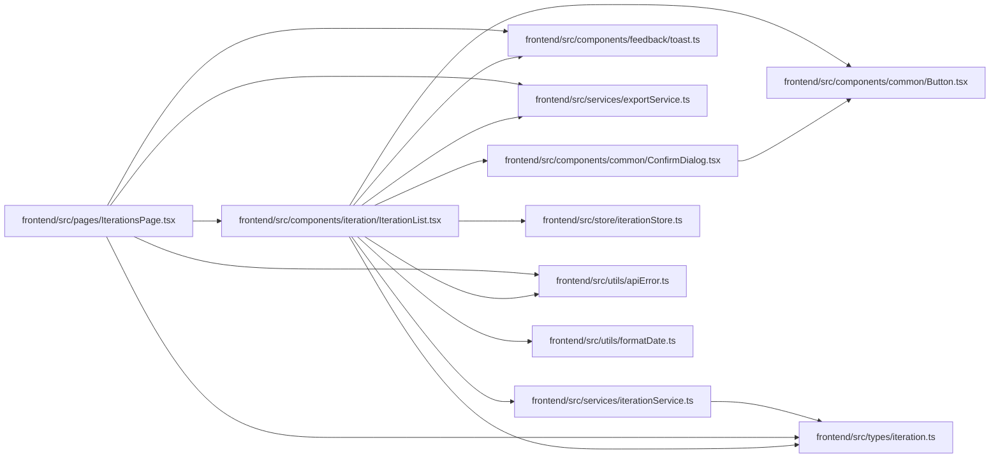

# IterationList Module

**Path:** `frontend/src/components/iteration/IterationList.tsx`

## Description

_Auto-generated from `frontend/src/components/iteration/IterationList.tsx`._

## Imports

| Source | Symbols |
|--------|---------|
| `../../services/exportService` | `exportService` |
| `../../services/iterationService` | `iterationService` |
| `../../store/iterationStore` | `useIterationStore` |
| `../../types/iteration` | `Iteration` |
| `../../utils/apiError` | `getApiErrorMessage` |
| `../../utils/formatDate` | `formatDate` |
| `../common/Button` | `Button` |
| `../common/ConfirmDialog` | `ConfirmDialog` |
| `../feedback/toast` | `useToast` |
| `@tanstack/react-query` | `useQuery`, `useMutation`, `useQueryClient` |
| `lucide-react` | `Calendar`, `Trash2`, `ArrowRight`, `Download`, `Upload`, `FolderOpen` |
| `react` | `useState`, `useRef` |
| `react-i18next` | `useTranslation` |
| `react-router-dom` | `Link` |

## Module Signals

| Signal | Values |
|--------|--------|
| Exports | `IterationList` |

## Local dependency map

<!-- Auto-generated local dependency summary. Do not edit by hand. -->

### Internal neighbors

| Direction | Module |
|---|---|
| Inbound | [IterationsPage](../modules/IterationsPage.md) |
| Outbound | [Button](../modules/Button.md) |
| Outbound | [ConfirmDialog](../modules/ConfirmDialog.md) |
| Outbound | [toast](../modules/toast.md) |
| Outbound | [exportService](../modules/exportService.md) |
| Outbound | [iterationService](../modules/iterationService.md) |
| Outbound | [iterationStore](../modules/iterationStore.md) |
| Outbound | [types_iteration](../modules/types_iteration.md) |
| Outbound | [apiError](../modules/apiError.md) |
| Outbound | [formatDate](../modules/formatDate.md) |

### External packages

| Language | Used packages | Undeclared packages |
|---|---:|---:|
| typescript | 5 | 0 |

## Classes

| Class | Kind | Line | Bases / Target | Description |
|-------|------|------|----------------|-------------|
| [IterationListProps](../entities/IterationListProps.md) | Class | 16 | — | — |

## Functions

| Function | Signature | Decorators | Description |
|----------|-----------|------------|-------------|
| `IterationList` | `({ onEdit }: IterationListProps)` | — | — |
