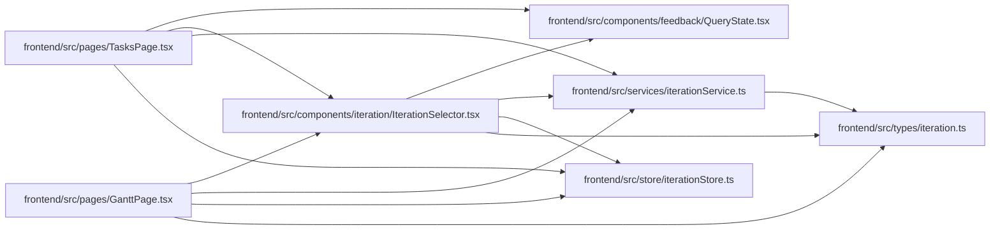

# IterationSelector Module

**Path:** `frontend/src/components/iteration/IterationSelector.tsx`

## Description

_Auto-generated from `frontend/src/components/iteration/IterationSelector.tsx`._

## Imports

| Source | Symbols |
|--------|---------|
| `../../services/iterationService` | `iterationService` |
| `../../store/iterationStore` | `useIterationStore` |
| `../../types/iteration` | `Iteration` |
| `../feedback/QueryState` | `QueryErrorState`, `QueryLoadingState` |
| `@tanstack/react-query` | `useQuery` |
| `clsx` | `clsx` |
| `react` | `useEffect` |
| `react-i18next` | `useTranslation` |

## Module Signals

| Signal | Values |
|--------|--------|
| Exports | `IterationSelector` |

## Local dependency map

<!-- Auto-generated local dependency summary. Do not edit by hand. -->

### Internal neighbors

| Direction | Module |
|---|---|
| Inbound | [GanttPage](../modules/GanttPage.md) |
| Inbound | [TasksPage](../modules/TasksPage.md) |
| Outbound | [QueryState](../modules/QueryState.md) |
| Outbound | [iterationService](../modules/iterationService.md) |
| Outbound | [iterationStore](../modules/iterationStore.md) |
| Outbound | [types_iteration](../modules/types_iteration.md) |

### External packages

| Language | Used packages | Undeclared packages |
|---|---:|---:|
| typescript | 4 | 0 |

## Classes

| Class | Kind | Line | Bases / Target | Description |
|-------|------|------|----------------|-------------|
| [IterationSelectorProps](../entities/IterationSelectorProps.md) | Class | 10 | — | — |

## Functions

| Function | Signature | Decorators | Description |
|----------|-----------|------------|-------------|
| `IterationSelector` | `({     className,     onChange,     showLabel = false, }: IterationSelectorProps)` | — | — |
