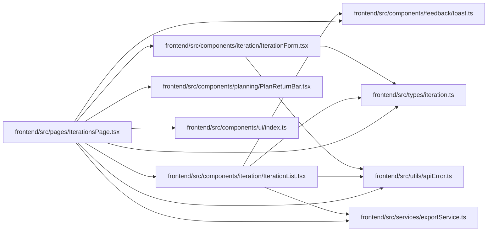

# IterationsPage Module

**Path:** `frontend/src/pages/IterationsPage.tsx`

## Description

_Auto-generated from `frontend/src/pages/IterationsPage.tsx`._

## Imports

| Source | Symbols |
|--------|---------|
| `../components/feedback/toast` | `useToast` |
| `../components/iteration/IterationForm` | `IterationForm` |
| `../components/iteration/IterationList` | `IterationList` |
| `../components/planning/PlanReturnBar` | `PlanReturnBar` |
| `../components/ui` | `PageHeader`, `PageLayout` |
| `../services/exportService` | `exportService` |
| `../types/iteration` | `Iteration` |
| `../utils/apiError` | `getApiErrorMessage` |
| `@tanstack/react-query` | `useQueryClient` |
| `react` | `useState`, `useRef` |
| `react-i18next` | `useTranslation` |

## Module Signals

| Signal | Values |
|--------|--------|
| Exports | `default` |

## Local dependency map

<!-- Auto-generated local dependency summary. Do not edit by hand. -->

### Internal neighbors

| Direction | Module |
|---|---|
| Outbound | [toast](../modules/toast.md) |
| Outbound | [IterationForm](../modules/IterationForm.md) |
| Outbound | [IterationList](../modules/IterationList.md) |
| Outbound | [PlanReturnBar](../modules/PlanReturnBar.md) |
| Outbound | [index](../modules/index.md) |
| Outbound | [exportService](../modules/exportService.md) |
| Outbound | [types_iteration](../modules/types_iteration.md) |
| Outbound | [apiError](../modules/apiError.md) |

### External packages

| Language | Used packages | Undeclared packages |
|---|---:|---:|
| typescript | 3 | 0 |
