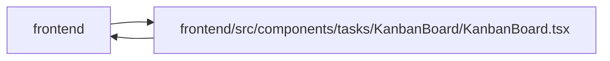

# KanbanBoard Module

**Path:** `frontend/src/components/tasks/KanbanBoard/KanbanBoard.tsx`

## Description

_Auto-generated from `frontend/src/components/tasks/KanbanBoard/KanbanBoard.tsx`._

## Imports

| Source | Symbols |
|--------|---------|
| `../../../services/labelService` | `labelService` |
| `../../../services/taskService` | `taskService` |
| `../../../services/teamService` | `teamService` |
| `../../../types/task` | `Task`, `TaskStatus`, `TaskUpdate` |
| `../../../utils/visibleWork` | `selectVisibleWork` |
| `../../common/Button` | `Button` |
| `../../common/Modal` | `Modal` |
| `../../feedback/QueryState` | `QueryErrorState`, `QueryLoadingState` |
| `../../feedback/WorkFreshness` | `WorkFreshness` |
| `../../ui/tone` | `STATUS_TONE` |
| `../TaskEditorDrawer` | `TaskEditorDrawer` |
| `../TaskFiltersBar` | `TaskFilters` |
| `./KanbanCard` | `KanbanCard` |
| `./KanbanColumn` | `KanbanColumn` |
| `@dnd-kit/core` | `DndContext`, `closestCorners`, `KeyboardSensor`, `PointerSensor`, `useSensor`, `useSensors`, `DragOverlay`, `defaultDropAnimationSideEffects`, `DragStartEvent`, `DragEndEvent` |
| `@dnd-kit/sortable` | `sortableKeyboardCoordinates` |
| `@tanstack/react-query` | `useQuery`, `useMutation`, `useQueryClient` |
| `react` | `useState`, `useMemo`, `useId`, `useRef` |
| `react-dom` | `createPortal` |
| `react-i18next` | `useTranslation` |
| `react-router-dom` | `Link` |

## Module Signals

| Signal | Values |
|--------|--------|
| Exports | `KanbanBoard` |
| Constants | `COLUMNS`, `VALID_TRANSITIONS` |

## Local dependency map

<!-- Auto-generated local dependency summary. Do not edit by hand. -->

> Module-level dependencies exceed the generated-diagram limits, so the diagram and table below group them by top-level package. Counts report the number of module neighbors in each package.

### Internal neighbors

| Direction | Module |
|---|---|
| Inbound | `frontend` (2) |
| Outbound | `frontend` (14) |

### External packages

| Language | Used packages | Undeclared packages |
|---|---:|---:|
| typescript | 7 | 0 |

> All 16 module neighbor(s) are summarized by package because the module-level view exceeds the 12-node limit.

## Classes

| Class | Kind | Line | Bases / Target | Description |
|-------|------|------|----------------|-------------|
| [KanbanBoardProps](../entities/KanbanBoardProps.md) | Class | 33 | — | — |
| [ColumnId](../entities/ColumnId.md) | Type alias | 38 | — | — |
| [BoardTaskUpdate](../entities/BoardTaskUpdate.md) | Type alias | 55 | — | — |
| [OwnershipSelection](../entities/OwnershipSelection.md) | Type alias | 59 | — | — |

## Functions

| Function | Signature | Decorators | Description |
|----------|-----------|------------|-------------|
| `KanbanBoard` | `({ iterationId, filters }: KanbanBoardProps)` | — | — |
