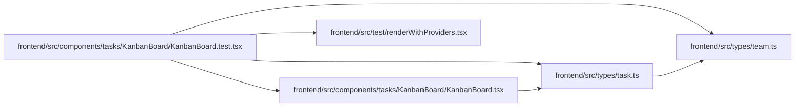

# KanbanBoard.test Module

**Path:** `frontend/src/components/tasks/KanbanBoard/KanbanBoard.test.tsx`

## Description

_Auto-generated from `frontend/src/components/tasks/KanbanBoard/KanbanBoard.test.tsx`._

## Imports

| Source | Symbols |
|--------|---------|
| `../../../test/renderWithProviders` | `renderWithProviders` |
| `../../../types/task` | `Task` |
| `../../../types/team` | `TeamMember` |
| `./KanbanBoard` | `KanbanBoard` |
| `@testing-library/react` | `screen`, `waitFor` |
| `react` | `ReactNode` |
| `vitest` | `beforeEach`, `describe`, `expect`, `it`, `vi` |

## Module Signals

| Signal | Values |
|--------|--------|
| Constants | `dragState`, `taskServiceMock`, `teamServiceMock`, `labelServiceMock` |
| Module calls | `dragState = hoisted`, `taskServiceMock = hoisted`, `teamServiceMock = hoisted`, `labelServiceMock = hoisted`, `mock`, `mock`, `mock`, `mock`, `mock`, `mock`, `describe` |

## Local dependency map

<!-- Auto-generated local dependency summary. Do not edit by hand. -->

### Internal neighbors

| Direction | Module |
|---|---|
| Outbound | [KanbanBoard](../modules/KanbanBoard.md) |
| Outbound | [renderWithProviders](../modules/renderWithProviders.md) |
| Outbound | [types_task](../modules/types_task.md) |
| Outbound | [types_team](../modules/types_team.md) |

### External packages

| Language | Used packages | Undeclared packages |
|---|---:|---:|
| typescript | 3 | 0 |

## Classes

| Class | Kind | Line | Bases / Target | Description |
|-------|------|------|----------------|-------------|
| [DndContextMockProps](../entities/DndContextMockProps.md) | Class | 29 | — | — |
