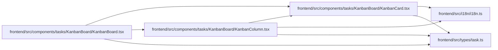

# KanbanCard Module

**Path:** `frontend/src/components/tasks/KanbanBoard/KanbanCard.tsx`

## Description

_Auto-generated from `frontend/src/components/tasks/KanbanBoard/KanbanCard.tsx`._

## Imports

| Source | Symbols |
|--------|---------|
| `../../../i18n/i18n` | `i18n` |
| `../../../types/task` | `Task` |
| `@dnd-kit/sortable` | `useSortable` |
| `@dnd-kit/utilities` | `CSS` |
| `clsx` | `clsx` |
| `lucide-react` | `Bot`, `Clock`, `User`, `AlertCircle`, `GripVertical` |

## Module Signals

| Signal | Values |
|--------|--------|
| Exports | `KanbanCard` |
| Constants | `t` |
| Module calls | `t = bind` |

## Local dependency map

<!-- Auto-generated local dependency summary. Do not edit by hand. -->

### Internal neighbors

| Direction | Module |
|---|---|
| Inbound | [KanbanBoard](../modules/KanbanBoard.md) |
| Inbound | [KanbanColumn](../modules/KanbanColumn.md) |
| Outbound | [i18n](../modules/i18n.md) |
| Outbound | [types_task](../modules/types_task.md) |

### External packages

| Language | Used packages | Undeclared packages |
|---|---:|---:|
| typescript | 4 | 0 |

## Classes

| Class | Kind | Line | Bases / Target | Description |
|-------|------|------|----------------|-------------|
| [KanbanCardProps](../entities/KanbanCardProps.md) | Class | 10 | — | — |

## Functions

| Function | Signature | Decorators | Description |
|----------|-----------|------------|-------------|
| `KanbanCard` | `({ task, onOpen }: KanbanCardProps)` | — | — |
