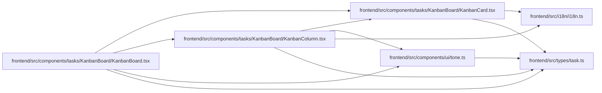

# KanbanColumn Module

**Path:** `frontend/src/components/tasks/KanbanBoard/KanbanColumn.tsx`

## Description

_Auto-generated from `frontend/src/components/tasks/KanbanBoard/KanbanColumn.tsx`._

## Imports

| Source | Symbols |
|--------|---------|
| `../../../i18n/i18n` | `i18n` |
| `../../../types/task` | `Task` |
| `../../ui/tone` | `PillTone`, `toneDotClassName` |
| `./KanbanCard` | `KanbanCard` |
| `@dnd-kit/core` | `useDroppable` |
| `@dnd-kit/sortable` | `SortableContext`, `verticalListSortingStrategy` |
| `clsx` | `clsx` |
| `react` | `useMemo` |

## Module Signals

| Signal | Values |
|--------|--------|
| Exports | `KanbanColumn` |
| Constants | `t` |
| Module calls | `t = bind` |

## Local dependency map

<!-- Auto-generated local dependency summary. Do not edit by hand. -->

### Internal neighbors

| Direction | Module |
|---|---|
| Inbound | [KanbanBoard](../modules/KanbanBoard.md) |
| Outbound | [KanbanCard](../modules/KanbanCard.md) |
| Outbound | [tone](../modules/tone.md) |
| Outbound | [i18n](../modules/i18n.md) |
| Outbound | [types_task](../modules/types_task.md) |

### External packages

| Language | Used packages | Undeclared packages |
|---|---:|---:|
| typescript | 4 | 0 |

## Classes

| Class | Kind | Line | Bases / Target | Description |
|-------|------|------|----------------|-------------|
| [KanbanColumnProps](../entities/KanbanColumnProps.md) | Class | 13 | — | — |

## Functions

| Function | Signature | Decorators | Description |
|----------|-----------|------------|-------------|
| `KanbanColumn` | `({ id, title, tasks, count, tone, onOpen }: KanbanColumnProps)` | — | — |
