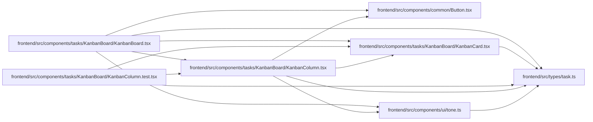

# KanbanColumn Module

**Path:** `frontend/src/components/tasks/KanbanBoard/KanbanColumn.tsx`

## Description

_Auto-generated from `frontend/src/components/tasks/KanbanBoard/KanbanColumn.tsx`._

## Imports

| Source | Symbols | Type-only | Runtime emission |
|--------|---------|-----------|------------------|
| `../../../types/task` | `Task` | Declaration | erased |
| `../../common/Button` | `Button` | — | compiler-dependent |
| `../../ui/tone` | `PillTone` | Declaration | erased |
| `../../ui/tone` | `toneDotClassName` | — | compiler-dependent |
| `./KanbanCard` | `KanbanCard` | — | compiler-dependent |
| `@dnd-kit/core` | `useDroppable` | — | compiler-dependent |
| `@dnd-kit/sortable` | `SortableContext`, `verticalListSortingStrategy` | — | compiler-dependent |
| `clsx` | `clsx` | — | compiler-dependent |
| `react` | `useMemo`, `useState` | — | compiler-dependent |
| `react-i18next` | `useTranslation` | — | compiler-dependent |

## Module Signals

| Signal | Values |
|--------|--------|
| Exports | `KanbanColumn` |
| Constants | `COLUMN_PAGE_SIZE` |

## Local dependency map

<!-- Auto-generated local dependency summary. Do not edit by hand. -->
This graph shows full source coupling. Type dependencies can be erased; compiler-dependent cycle groups are runtime candidates, not confirmed initialization cycles.

```mermaid
flowchart LR
    n0["frontend/src/components/common/Button.tsx"]
    n1["frontend/src/components/tasks/KanbanBoard/KanbanBoard.tsx"]
    n2["frontend/src/components/tasks/KanbanBoard/KanbanCard.tsx"]
    n3["frontend/src/components/tasks/KanbanBoard/KanbanColumn.test.tsx"]
    n4["frontend/src/components/tasks/KanbanBoard/KanbanColumn.tsx"]
    n5["frontend/src/components/ui/tone.ts"]
    n6["frontend/src/types/task.ts"]
    n1 --> n0
    n1 --> n2
    n1 --> n4
    n1 --> n5
    n1 --> n6
    n2 --> n6
    n3 --> n2
    n3 --> n4
    n3 --> n6
    n4 --> n0
    n4 --> n2
    n4 --> n5
    n4 --> n6
    n5 --> n6
    click n0 "../modules/Button.md"
    click n1 "../modules/KanbanBoard.md"
    click n2 "../modules/KanbanCard.md"
    click n3 "../modules/KanbanColumn.test.md"
    click n4 "../modules/KanbanColumn.md"
    click n5 "../modules/tone.md"
    click n6 "../modules/types_task.md"
```

### Internal neighbors

| Direction | Module |
|---|---|
| Inbound | [KanbanBoard](../modules/KanbanBoard.md) |
| Inbound | [KanbanColumn.test](../modules/KanbanColumn.test.md) |
| Outbound | [Button](../modules/Button.md) |
| Outbound | [KanbanCard](../modules/KanbanCard.md) |
| Outbound | [tone](../modules/tone.md) |
| Outbound | [types_task](../modules/types_task.md) |

### External packages

| Language | Used packages | Undeclared packages |
|---|---:|---:|
| typescript | 5 | 0 |

## Classes

| Class | Kind | Line | Bases / Target | Description |
|-------|------|------|----------------|-------------|
| [KanbanColumnProps](../entities/KanbanColumnProps.md) | Interface | 15 | — | — |

## Functions

| Function | Signature | Decorators | Description |
|----------|-----------|------------|-------------|
| `KanbanColumn` | `({ id, title, tasks, count, tone, onOpen }: KanbanColumnProps)` | — | — |
