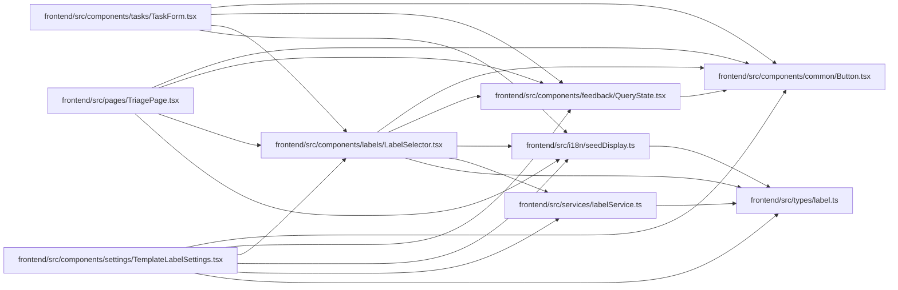

# LabelSelector Module

**Path:** `frontend/src/components/labels/LabelSelector.tsx`

## Description

_Auto-generated from `frontend/src/components/labels/LabelSelector.tsx`._

## Imports

| Source | Symbols |
|--------|---------|
| `../../i18n/seedDisplay` | `labelDisplay`, `labelGroupDisplay` |
| `../../services/labelService` | `labelService` |
| `../../types/label` | `Label` |
| `../common/Button` | `Button` |
| `../feedback/QueryState` | `QueryErrorState`, `QueryLoadingState` |
| `@tanstack/react-query` | `useQuery` |
| `lucide-react` | `Plus`, `X` |
| `react` | `useMemo`, `useState` |
| `react-i18next` | `useTranslation` |

## Module Signals

| Signal | Values |
|--------|--------|
| Exports | `LabelSelector` |

## Local dependency map

<!-- Auto-generated local dependency summary. Do not edit by hand. -->

### Internal neighbors

| Direction | Module |
|---|---|
| Inbound | [TemplateLabelSettings](../modules/TemplateLabelSettings.md) |
| Inbound | [TaskForm](../modules/TaskForm.md) |
| Inbound | [TriagePage](../modules/TriagePage.md) |
| Outbound | [Button](../modules/Button.md) |
| Outbound | [QueryState](../modules/QueryState.md) |
| Outbound | [seedDisplay](../modules/seedDisplay.md) |
| Outbound | [labelService](../modules/labelService.md) |
| Outbound | [types_label](../modules/types_label.md) |

### External packages

| Language | Used packages | Undeclared packages |
|---|---:|---:|
| typescript | 4 | 0 |

## Classes

| Class | Kind | Line | Bases / Target | Description |
|-------|------|------|----------------|-------------|
| [LabelSelectorProps](../entities/LabelSelectorProps.md) | Class | 11 | — | — |
| [LabelOption](../entities/LabelOption.md) | Type alias | 20 | — | — |

## Functions

| Function | Signature | Decorators | Description |
|----------|-----------|------------|-------------|
| `LabelSelector` | `({     value,     onChange,     label,     placeholder,     allowCustom = true,     className, }: LabelSelectorProps)` | — | — |
