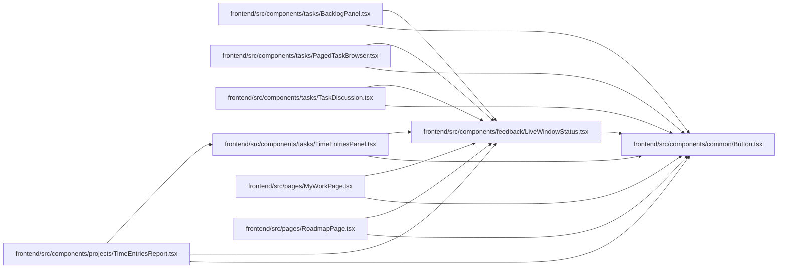

# LiveWindowStatus Module

**Path:** `frontend/src/components/feedback/LiveWindowStatus.tsx`

## Description

_Auto-generated from `frontend/src/components/feedback/LiveWindowStatus.tsx`._

## Imports

| Source | Symbols |
|--------|---------|
| `../common/Button` | `Button` |
| `react-i18next` | `useTranslation` |

## Module Signals

| Signal | Values |
|--------|--------|
| Exports | `LiveWindowStatus` |

## Local dependency map

<!-- Auto-generated local dependency summary. Do not edit by hand. -->

### Internal neighbors

| Direction | Module |
|---|---|
| Inbound | [TimeEntriesReport](../modules/TimeEntriesReport.md) |
| Inbound | [BacklogPanel](../modules/BacklogPanel.md) |
| Inbound | [PagedTaskBrowser](../modules/PagedTaskBrowser.md) |
| Inbound | [TaskDiscussion](../modules/TaskDiscussion.md) |
| Inbound | [TimeEntriesPanel](../modules/TimeEntriesPanel.md) |
| Inbound | [MyWorkPage](../modules/MyWorkPage.md) |
| Inbound | [RoadmapPage](../modules/RoadmapPage.md) |
| Outbound | [Button](../modules/Button.md) |

### External packages

| Language | Used packages | Undeclared packages |
|---|---:|---:|
| typescript | 1 | 0 |

## Functions

| Function | Signature | Decorators | Description |
|----------|-----------|------------|-------------|
| `LiveWindowStatus` | `({ window }: { window: {     outsideWindow: boolean; headError: boolean; isFetching: boolean; restart: () => Promise<void>; } })` | — | — |
