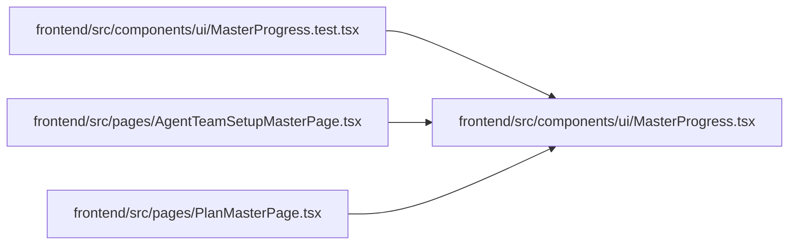

# MasterProgress Module

**Path:** `frontend/src/components/ui/MasterProgress.tsx`

## Description

_Auto-generated from `frontend/src/components/ui/MasterProgress.tsx`._

## Module Signals

| Signal | Values |
|--------|--------|
| Exports | `MasterProgress` |

## Local dependency map

<!-- Auto-generated local dependency summary. Do not edit by hand. -->

### Internal neighbors

| Direction | Module |
|---|---|
| Inbound | [MasterProgress.test](../modules/MasterProgress.test.md) |
| Inbound | [AgentTeamSetupMasterPage](../modules/AgentTeamSetupMasterPage.md) |
| Inbound | [PlanMasterPage](../modules/PlanMasterPage.md) |

## Classes

| Class | Kind | Line | Bases / Target | Description |
|-------|------|------|----------------|-------------|
| [MasterProgressProps](../entities/MasterProgressProps.md) | Class | 1 | — | — |

## Functions

| Function | Signature | Decorators | Description |
|----------|-----------|------------|-------------|
| `MasterProgress` | `({     className = '',     completed,     label,     total,     valueText, }: MasterProgressProps)` | — | — |
