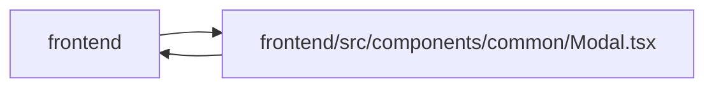

# Modal Module

**Path:** `frontend/src/components/common/Modal.tsx`

## Description

_Auto-generated from `frontend/src/components/common/Modal.tsx`._

## Imports

| Source | Symbols |
|--------|---------|
| `./dialogLayer` | `useDialogLayer` |
| `clsx` | `clsx` |
| `lucide-react` | `X` |
| `react` | `useId`, `ReactNode`, `RefObject` |
| `react-dom` | `createPortal` |

## Module Signals

| Signal | Values |
|--------|--------|
| Exports | `Modal`, `ModalProps` |

## Local dependency map

<!-- Auto-generated local dependency summary. Do not edit by hand. -->

> Module-level dependencies exceed the generated-diagram limits, so the diagram and table below group them by top-level package. Counts report the number of module neighbors in each package.

### Internal neighbors

| Direction | Module |
|---|---|
| Inbound | `frontend` (18) |
| Outbound | `frontend` (1) |

### External packages

| Language | Used packages | Undeclared packages |
|---|---:|---:|
| typescript | 4 | 0 |

> All 19 module neighbor(s) are summarized by package because the module-level view exceeds the 12-node limit.

## Classes

| Class | Kind | Line | Bases / Target | Description |
|-------|------|------|----------------|-------------|
| [ModalProps](../entities/ModalProps.md) | Class | 8 | — | — |

## Functions

| Function | Signature | Decorators | Description |
|----------|-----------|------------|-------------|
| `Modal` | `({     open,     title,     description,     children,     footer,     onClose,     closeLabel,     initialFocusRef,     closeOnBackdropClick = false,     closeDisabled = false,     fullScreen = false,     className,     contentClassName, }: ModalProps)` | — | — |
