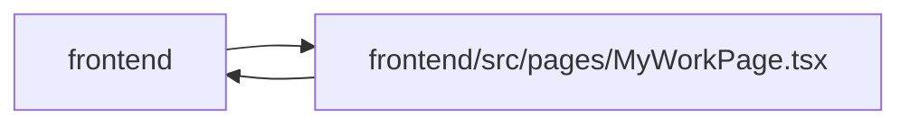

# MyWorkPage Module

**Path:** `frontend/src/pages/MyWorkPage.tsx`

## Description

Presents authenticated human work, independent review and personal inbox queues across authorized projects. It retains task return context and uses the shared guarded editor. Availability, notification state and delivery failures have explicit controls; unlinked profiles, missing membership and unavailable tasks are surfaced rather than inferred.

Only the selected work/review/inbox consumers remain enabled. Paged queues use retained windows and independent head discovery; latest-window navigation preserves task selection. Closing an editor refreshes only the relevant enabled queue.

## Imports

| Source | Symbols |
|--------|---------|
| `../components/common/Button` | `Button` |
| `../components/feedback/LiveWindowStatus` | `LiveWindowStatus` |
| `../components/feedback/QueryState` | `QueryErrorState` |
| `../components/tasks/GuardedTaskModal` | `CurrentTaskModal` |
| `../components/tasks/PersonCapacity` | `PersonCapacity` |
| `../components/ui` | `PageLayout`, `PageHeader` |
| `../features/identity/identityContext` | `useIdentity` |
| `../features/useLiveWindow` | `useLiveWindow` |
| `../services/api` | `api` |
| `../services/discussionService` | `discussionService` |
| `../types/task` | `TaskReference`, `TaskReferencePage` |
| `../utils/apiError` | `getApiErrorMessage` |
| `@tanstack/react-query` | `useMutation` |
| `react-i18next` | `useTranslation` |
| `react-router-dom` | `useSearchParams` |

## Module Signals

| Signal | Values |
|--------|--------|
| Exports | `default` |
| Constants | `QUEUES` |

## Local dependency map

<!-- Auto-generated local dependency summary. Do not edit by hand. -->

> Module-level dependencies exceed the generated-diagram limits, so the diagram and table below group them by top-level package. Counts report the number of module neighbors in each package.

### Internal neighbors

| Direction | Module |
|---|---|
| Inbound | `frontend` (1) |
| Outbound | `frontend` (12) |

### External packages

| Language | Used packages | Undeclared packages |
|---|---:|---:|
| typescript | 3 | 0 |

> All 13 module neighbor(s) are summarized by package because the module-level view exceeds the 12-node limit.

## Classes

| Class | Kind | Line | Bases / Target | Description |
|-------|------|------|----------------|-------------|
| [WorkPage](../entities/WorkPage.md) | Class | 19 | — | — |
| [Queue](../entities/Queue.md) | Type alias | 18 | — | — |