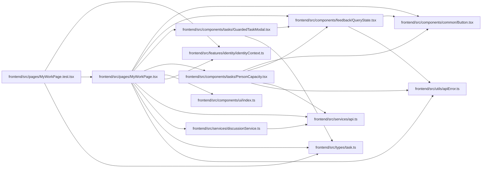

# MyWorkPage Module

**Path:** `frontend/src/pages/MyWorkPage.tsx`

## Description

Presents authenticated human work, independent review and personal inbox queues across authorized projects. It retains task return context and uses the shared guarded editor. Availability, notification state and delivery failures have explicit controls; unlinked profiles, missing membership and unavailable tasks are surfaced rather than inferred.

## Imports

| Source | Symbols |
|--------|---------|
| `../components/common/Button` | `Button` |
| `../components/feedback/QueryState` | `QueryErrorState` |
| `../components/tasks/GuardedTaskModal` | `CurrentTaskModal` |
| `../components/tasks/PersonCapacity` | `PersonCapacity` |
| `../components/ui` | `PageLayout`, `PageHeader` |
| `../features/identity/identityContext` | `useIdentity` |
| `../services/api` | `api` |
| `../services/discussionService` | `discussionService` |
| `../types/task` | `TaskReference`, `TaskReferencePage` |
| `../utils/apiError` | `getApiErrorMessage` |
| `@tanstack/react-query` | `useInfiniteQuery`, `useMutation` |
| `react-i18next` | `useTranslation` |
| `react-router-dom` | `useSearchParams` |

## Module Signals

| Signal | Values |
|--------|--------|
| Exports | `default` |
| Constants | `QUEUES` |

## Local dependency map

<!-- Auto-generated local dependency summary. Do not edit by hand. -->

### Internal neighbors

| Direction | Module |
|---|---|
| Inbound | [MyWorkPage.test](../modules/MyWorkPage.test.md) |
| Outbound | [Button](../modules/Button.md) |
| Outbound | [QueryState](../modules/QueryState.md) |
| Outbound | [GuardedTaskModal](../modules/GuardedTaskModal.md) |
| Outbound | [PersonCapacity](../modules/PersonCapacity.md) |
| Outbound | [index](../modules/index.md) |
| Outbound | [identityContext](../modules/identityContext.md) |
| Outbound | [api](../modules/api.md) |
| Outbound | [discussionService](../modules/discussionService.md) |
| Outbound | [types_task](../modules/types_task.md) |
| Outbound | [apiError](../modules/apiError.md) |

### External packages

| Language | Used packages | Undeclared packages |
|---|---:|---:|
| typescript | 3 | 0 |

## Classes

| Class | Kind | Line | Bases / Target | Description |
|-------|------|------|----------------|-------------|
| [WorkPage](../entities/WorkPage.md) | Class | 17 | — | — |
| [Queue](../entities/Queue.md) | Type alias | 16 | — | — |