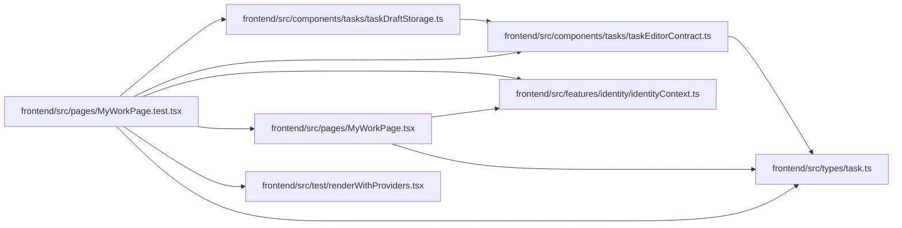

# MyWorkPage.test Module

**Path:** `frontend/src/pages/MyWorkPage.test.tsx`

## Description

_Auto-generated from `frontend/src/pages/MyWorkPage.test.tsx`._

## Imports

| Source | Symbols |
|--------|---------|
| `../components/tasks/taskDraftStorage` | `writeTaskDraft` |
| `../components/tasks/taskEditorContract` | `buildTaskEditorDefaults` |
| `../features/identity/identityContext` | `IdentityContext` |
| `../test/renderWithProviders` | `createTestQueryClient`, `renderWithProviders` |
| `../types/task` | `Task` |
| `./MyWorkPage` | `MyWorkPage` |
| `@testing-library/react` | `act`, `screen`, `waitFor` |
| `vitest` | `expect`, `it`, `vi` |

## Module Signals

| Signal | Values |
|--------|--------|
| Constants | `api` |
| Module calls | `api = hoisted`, `mock`, `mock`, `mock`, `mock`, `mock`, `mock`, `mock`, `it`, `it` |

## Local dependency map

<!-- Auto-generated local dependency summary. Do not edit by hand. -->

### Internal neighbors

| Direction | Module |
|---|---|
| Outbound | [taskDraftStorage](../modules/taskDraftStorage.md) |
| Outbound | [taskEditorContract](../modules/taskEditorContract.md) |
| Outbound | [identityContext](../modules/identityContext.md) |
| Outbound | [MyWorkPage](../modules/MyWorkPage.md) |
| Outbound | [renderWithProviders](../modules/renderWithProviders.md) |
| Outbound | [types_task](../modules/types_task.md) |

### External packages

| Language | Used packages | Undeclared packages |
|---|---:|---:|
| typescript | 2 | 0 |
