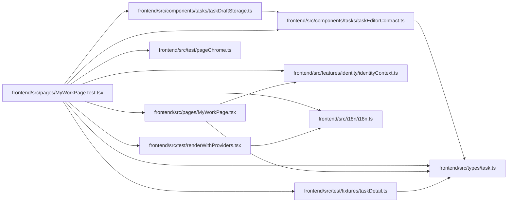

# MyWorkPage.test Module

**Path:** `frontend/src/pages/MyWorkPage.test.tsx`

## Description

_Auto-generated from `frontend/src/pages/MyWorkPage.test.tsx`._

## Imports

| Source | Symbols | Type-only | Runtime emission |
|--------|---------|-----------|------------------|
| `../components/tasks/taskDraftStorage` | `writeTaskDraft` | — | compiler-dependent |
| `../components/tasks/taskEditorContract` | `buildTaskEditorDefaults` | — | compiler-dependent |
| `../features/identity/identityContext` | `IdentityContext` | — | compiler-dependent |
| `../i18n/i18n` | `i18n` | — | compiler-dependent |
| `../test/fixtures/taskDetail` | `taskDetailResponse` | — | compiler-dependent |
| `../test/pageChrome` | `expectPageChrome` | — | compiler-dependent |
| `../test/renderWithProviders` | `createTestQueryClient`, `renderWithProviders` | — | compiler-dependent |
| `../types/task` | `Task` | Declaration | erased |
| `./MyWorkPage` | `MyWorkPage` | — | compiler-dependent |
| `@testing-library/react` | `act`, `fireEvent`, `screen`, `waitFor`, `within` | — | compiler-dependent |
| `react-router-dom` | `useLocation` | — | compiler-dependent |
| `vitest` | `describe`, `expect`, `it`, `vi` | — | compiler-dependent |

## Module Signals

| Signal | Values |
|--------|--------|
| Constants | `api`, `signedInIdentity` |
| Module calls | `api = hoisted`, `mock`, `mock`, `mock`, `mock`, `mock`, `mock`, `mock`, `it`, `it`, `it`, `it`, `it.each(['active', 'review', 'inbox'])`, `describe`, `describe`, `it.each(['active', 'queued', 'blocked', 'awaiting_review', 'review'])`, `it`, `it.each(['active', 'inbox'])` |

## Local dependency map

<!-- Auto-generated local dependency summary. Do not edit by hand. -->
This graph shows full source coupling. Type dependencies can be erased; compiler-dependent cycle groups are runtime candidates, not confirmed initialization cycles.

```mermaid
flowchart LR
    n0["frontend/src/components/tasks/taskDraftStorage.ts"]
    n1["frontend/src/components/tasks/taskEditorContract.ts"]
    n2["frontend/src/features/identity/identityContext.ts"]
    n3["frontend/src/i18n/i18n.ts"]
    n4["frontend/src/pages/MyWorkPage.test.tsx"]
    n5["frontend/src/pages/MyWorkPage.tsx"]
    n6["frontend/src/test/fixtures/taskDetail.ts"]
    n7["frontend/src/test/pageChrome.ts"]
    n8["frontend/src/test/renderWithProviders.tsx"]
    n9["frontend/src/types/task.ts"]
    n0 --> n1
    n1 --> n9
    n4 --> n0
    n4 --> n1
    n4 --> n2
    n4 --> n3
    n4 --> n5
    n4 --> n6
    n4 --> n7
    n4 --> n8
    n4 --> n9
    n5 --> n2
    n5 --> n9
    n6 --> n9
    n8 --> n3
    click n0 "../modules/taskDraftStorage.md"
    click n1 "../modules/taskEditorContract.md"
    click n2 "../modules/identityContext.md"
    click n3 "../modules/i18n.md"
    click n4 "../modules/MyWorkPage.test.md"
    click n5 "../modules/MyWorkPage.md"
    click n6 "../modules/taskDetail.md"
    click n7 "../modules/pageChrome.md"
    click n8 "../modules/renderWithProviders.md"
    click n9 "../modules/types_task.md"
```

### Internal neighbors

| Direction | Module |
|---|---|
| Outbound | [taskDraftStorage](../modules/taskDraftStorage.md) |
| Outbound | [taskEditorContract](../modules/taskEditorContract.md) |
| Outbound | [identityContext](../modules/identityContext.md) |
| Outbound | [i18n](../modules/i18n.md) |
| Outbound | [MyWorkPage](../modules/MyWorkPage.md) |
| Outbound | [taskDetail](../modules/taskDetail.md) |
| Outbound | [pageChrome](../modules/pageChrome.md) |
| Outbound | [renderWithProviders](../modules/renderWithProviders.md) |
| Outbound | [types_task](../modules/types_task.md) |

### External packages

| Language | Used packages | Undeclared packages |
|---|---:|---:|
| typescript | 3 | 0 |
